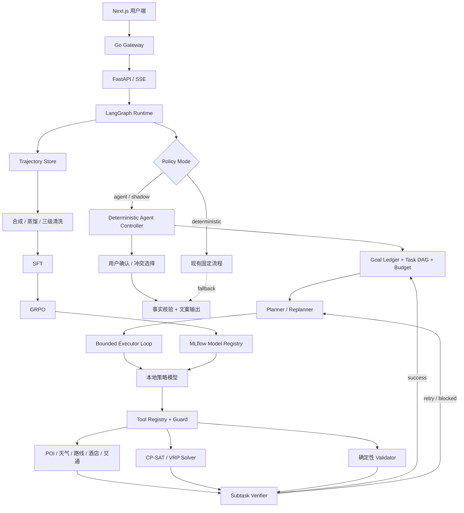

# TravelAgent-RL：确定性约束求解与 Agentic RL 策略优化融合 SPEC

> 文档状态：Proposed（待评审）  
> 版本：v1.2（Agentic RL + Long-Horizon Agent Loop 文献审查修订）  
> 编写日期：2026-08-12  
> 适用仓库：`TravelAgent2`  
> 文档用途：作为后续架构改造、数据构建、SFT/GRPO 训练、线上接入和效果验收的唯一实施基线。
> 研究依据：`docs/research/Agentic_RL_文献调研与SPEC修订建议_2026.md`。论文结论只用于设计假设，最终效果必须由本项目实验验证。
> Agent Loop 依据：`docs/research/Long_Horizon_Agent_Loop_专题调研与设计_2026.md`。

---

## 1. 摘要

本项目将在现有 TravelAgent2 生产型旅行规划系统之上，引入一个可通过 SFT 和 GRPO 优化的 Long-Horizon Agent 策略层，形成：

> **TravelAgent-RL：具备自主多轮工具决策、确定性约束求解、人工确认和 Agentic RL 策略优化能力的长程出行智能体。**

系统不让大模型直接编排行程。大模型负责判断“下一步做什么”，旅行工具负责返回事实，OR-Tools CP-SAT/VRP 负责计算满足硬约束的日程，LangGraph 负责状态、循环、人工确认、异常和回退。

融合后的核心闭环为：

```text
用户需求
  → Agent 判断信息缺口
  → 自主选择并调用工具
  → 读取 Observation
  → 调用确定性求解器
  → 根据求解冲突继续查询、调整或追问
  → 通过确定性校验
  → 用户确认
  → 输出最终行程
  → 保存轨迹、反馈与指标
  → SFT / GRPO 优化策略模型
  → 新模型灰度回到线上
```

该改造不推翻现有网关、FastAPI、LangGraph、RAG、记忆、VRP Solver、SSE、PostgreSQL、Redis、Celery 和部署体系。

---

## 2. 背景与问题定义

### 2.1 当前系统已经具备的能力

当前 TravelAgent2 已经具备完整的工程和确定性规划骨架：

- 自然语言需求解析和多轮槽位收集；
- 用户画像与记忆召回；
- RAG POI 检索和天气查询；
- OR-Tools CP-SAT/贪心求解；
- 营业时间、闭馆日、预算、体力、路程、预约等约束；
- LangGraph 编排、Checkpoint 和 Human-in-the-loop；
- 工具定义与统一执行器；
- 事实检查、幻觉检查和降级；
- SSE 流式交互、异步任务、网关与可观测性；
- DeepSeek API 和本地 OpenAI-compatible 模型路由。

### 2.2 当前系统的关键不足

当前系统虽然叫 Agent，但主要决策路径仍由代码预先规定：

- LangGraph 节点顺序基本固定；
- 确认后的工具调用主要由代码批量生成；
- 模型不能根据 Observation 动态决定下一步；
- 求解失败后的调整策略大部分是固定规则；
- `ml/training/train_lora.py` 当前只记录占位元数据和模拟指标，没有真实训练；
- 没有统一的 Agent 轨迹数据格式；
- 没有 Base、SFT、SFT+GRPO 的固定评测基线；
- 没有可复现的多轮训练环境和自动 Reward。

因此，当前项目强在工程和确定性规划，弱在“模型策略是如何被数据和强化学习优化的”。

### 2.3 本次改造要解决的问题

本次改造聚焦一个核心问题：

> 如何让模型学会在复杂出行规划中进行多步工具决策，同时确保最终行程不违反可计算的业务约束？

答案不是用模型替换求解器，而是让两者形成分工：

- Agent 策略模型解决开放式决策；
- 确定性求解器解决精确组合优化；
- 确定性校验器为训练提供客观 Reward；
- 固定编排保留为生产回退路径。

---

## 3. 目标与非目标

### 3.1 产品目标

1. Agent 能在多轮交互中主动补全需求，而不是机械执行固定流程。
2. Agent 能根据当前状态自主选择旅行工具并填写正确参数。
3. Agent 能调用 CP-SAT 求解器，并理解可行、不可行和降级结果。
4. 当约束冲突时，Agent 能选择查询替代项、放宽软约束或询问用户。
5. 最终行程必须通过确定性校验和用户确认。
6. 线上真实轨迹和用户反馈能进入离线数据闭环。

### 3.2 算法目标

1. 建立可复现的 Long-Horizon 旅行任务环境。
2. 建立 ReAct/Tool Calling 轨迹的合成、蒸馏和三级清洗流水线。
3. 使用真实的 SFT 冷启动训练策略模型。
4. 使用多维 Reward 完成 GRPO 策略优化。
5. 对 Base、SFT、SFT+GRPO 进行统一测试集评测。
6. 通过 Reward 消融证明各奖励项的实际作用。

### 3.3 工程目标

1. 训练环境与线上环境复用相同工具契约。
2. Agent 模式通过 Feature Flag 接入，不影响现有稳定流程。
3. 支持影子运行、灰度发布、指标监控和自动回退。
4. 所有训练和评测实验均可复现并登记到 MLflow。

### 3.4 非目标

首版明确不做以下事项：

- 不让 LLM 独立生成未经求解器验证的最终行程；
- 不使用 GRPO 训练文案表达能力；
- 不在训练 Rollout 中直接高频请求高德、Tavily 等实时付费 API；
- 不将预订支付等高风险操作交给模型自动执行；
- 不一次性替换现有 LangGraph 固定流程；
- 不把现有占位 LoRA 目录描述成已完成 SFT；
- 不以单一 LLM Judge 分数作为最终成功标准；
- 不在本地 8GB 显存设备上强行完成正式 7B 多轮 GRPO。

---

## 4. 核心架构原则

以下原则为不可违反的架构约束。

### P1：模型有策略决策权，没有事实编造权

模型可以决定调用哪个工具，但 POI、天气、路线、价格和营业时间必须来自工具 Observation。模型不得创建不存在的 POI 或覆盖工具事实。

### P2：模型有软约束调整权，没有硬约束绕过权

兴趣匹配、景点风格和方案偏好属于软约束；营业时间、闭馆日、预算上限、预约、最大路程和安全规则属于硬约束。硬约束只能由用户明确修改或由规则定义，模型不能静默放宽。

### P3：Agent 决策与确定性求解职责分离

Agent 决定“查什么、何时求解、失败后怎么办”；CP-SAT 决定“景点在哪一天、几点开始、是否可行”。

### P4：线上工具与训练工具同契约、不同数据源

工具名、参数、返回结构一致；线上环境使用实时 API，训练环境使用版本化快照或模拟故障，保证可复现、低成本和无数据漂移。

### P5：任何新策略都必须可回退

Agent 超时、循环、工具错误、模型不可用或质量门禁失败时，系统自动回到当前确定性流程，不影响用户完成行程。

### P6：训练效果以程序指标为主，LLM Judge 为辅

约束满足率、工具参数有效率、完成率和预算误差由程序计算；连贯性、个性化和文字质量可由 LLM Judge 辅助判断。

### P7：不训练、不记录私有思维链

轨迹只保存可审计的 action、tool call、observation、简短 decision summary 和 final answer，不要求或持久化模型隐藏推理过程。

### P8：终局可验证结果为主，过程塑形受限

Solver、Validator 和环境真实状态提供主要 Reward；过程信号只奖励 Schema、合法工具、参数溯源、实际信息增益等可验证事件，并设置总上限。不得奖励“看起来合理的分析过程”。

### P9：训练执行与线上 Agent 解耦，但共享同一事件语义

LangGraph 不直接耦合 Trainer。线上与训练统一产生 `state → action → observation → reward signal` 事件，由轨迹接口连接训练系统，避免为了 RL 重写生产工作流。

---

## 5. 目标系统整体架构



### 5.1 在线平面

负责真实用户请求，包括：

- 需求收集；
- Agent 多轮工具决策；
- 确定性求解和校验；
- 用户确认；
- 事实核验、输出和预订建议；
- 轨迹、反馈、性能和错误采集。

### 5.2 离线训练平面

负责：

- 任务模板和种子数据；
- Teacher 模型轨迹蒸馏；
- 轨迹回放和清洗；
- SFT；
- GRPO Rollout；
- 模型评测、对比和注册。

### 5.3 共享契约层

线上和离线必须共享：

- 工具名称及 JSON Schema；
- Observation Envelope；
- SolverRequest/SolverResponse；
- 错误码和降级语义；
- Agent Action 和终止原因；
- Reward 指标定义；
- 评测任务格式。
- Goal、Task、Fact、Artifact、Failure 和 PlanVersion Schema；
- 子任务完成标准、失效传播和全局终止语义。

---

## 6. 最终用户流程

### 6.1 正常规划流程

1. 用户提交自然语言需求。
2. 系统通过规则和轻量解析得到初始槽位。
3. Agent 判断信息是否足以规划。
4. 信息不足时调用 `ask_user`，LangGraph 暂停等待用户回复。
5. 信息充分后，Agent按需要查询天气、POI、详情、酒店和路线。
6. Agent 调用 `solve_itinerary`。
7. Solver 返回可行计划或结构化冲突。
8. 可行计划进入 `validate_itinerary`。
9. 校验通过后展示草稿并进入 `confirm_gate`。
10. 用户确认、修改或拒绝。
11. 修改进入局部决策或重新求解；确认进入事实核验和最终输出。

### 6.2 求解冲突流程

Solver 必须返回机器可读的冲突信息，例如：

```json
{
  "status": "infeasible",
  "conflicts": [
    {
      "code": "TOO_MANY_REMOTE_POIS",
      "severity": "hard",
      "entities": ["上海迪士尼", "朱家角", "辰山植物园"],
      "suggestions": ["drop_one", "add_day"]
    }
  ]
}
```

Agent 允许选择：

- 搜索同类替代 POI；
- 删除非必去的低优先级 POI；
- 调整软偏好；
- 询问用户删减景点或增加天数；
- 在达到循环上限后转入固定流程或人工处理。

Agent 不允许：

- 删除 `must_visit` 而不询问用户；
- 静默提高预算；
- 忽略闭馆、预约和安全冲突；
- 修改工具 Observation 中的事实。

### 6.3 行程中动态重规划

天气预警、交通延误或景点临时关闭进入 `external_event`：

1. 系统加载原行程 Checkpoint；
2. 锁定已经完成和用户明确保留的活动；
3. Agent 查询受影响事实；
4. 调用局部重规划工具；
5. Validator 检查新旧方案差异和约束；
6. 用户确认后更新行程版本。

首版只允许局部修改未开始的活动，不自动修改已预订项目。

---

## 7. Agent Policy Loop 设计

### 7.1 Long-Horizon 控制结构

Agent Loop 采用“确定性外壳 + 动态任务图 + 有界执行循环”，而不是让一个 ReAct 对话从头自由运行到尾：

```text
Goal / External Event
  → Capability & Constraint Gate
  → Planner 创建或修订 Task DAG
  → Scheduler 选择 READY 子任务
  → Executor 对当前子任务执行有限步 Action/Observation Loop
  → Subtask Verifier 验收
      ├─ success → 提交事实/产物，推进 DAG
      ├─ retryable → 有界重试
      ├─ blocked → ask_user / propose_tradeoff
      └─ plan_invalid → 只重规划受影响的剩余子图
  → DAG 无未完成 required task
  → Global Validator
  → 用户确认
  → finish
```

Planner 与 Executor 是两个职责和上下文契约，首版可以由同一个模型分角色调用，不要求部署多个模型：

- Planner 只负责子目标、依赖、成功条件和剩余计划；
- Executor 只负责把当前子目标变成一个或一批合法工具动作；
- Verifier 和 Scheduler 由程序控制；
- 模型无权直接把 Task 标记为成功，也无权绕过 Global Validator。

### 7.2 Goal Ledger 与能力边界

每个 Episode 初始化权威目标账本：

```json
{
  "goal_version": 1,
  "original_request": "一家四口上海5天，预算16000，有老人",
  "success_definition": ["生成5日可执行行程", "通过硬约束", "等待用户确认"],
  "hard_constraints": {},
  "soft_preferences": {},
  "locked_items": [],
  "user_authorizations": [],
  "missing_information": [],
  "capability": {
    "status": "solvable|needs_user|missing_tool|infeasible|unsafe",
    "evidence": []
  }
}
```

进入任务图前先区分：

- 信息缺失但工具可检索：创建信息获取任务；
- 信息只能由用户提供：`ask_user`；
- 缺少必要工具或权限：明确能力边界，不虚构完成；
- 约束不可同时满足：给出 Solver/Validator 证据并 `propose_tradeoff`；
- 纯陈述或无可执行意图：不进入规划 Loop。

### 7.3 Task DAG 与进度账本

子任务最小 Schema：

```json
{
  "task_id": "collect_poi_details",
  "goal": "获得入选 POI 的营业时间、票价和建议游玩时长",
  "status": "pending|ready|running|blocked|succeeded|failed|invalidated|skipped",
  "depends_on": ["search_candidates"],
  "required_facts": ["candidate_poi_ids"],
  "allowed_actions": ["get_poi_detail"],
  "success_criteria": {},
  "artifact_refs": [],
  "attempts": 0,
  "max_attempts": 2,
  "failure": null,
  "invalidates_on": ["destination_changed", "travel_dates_changed"]
}
```

状态转换由 Controller/Verifier 提交：

```text
pending → ready → running → succeeded
                     ├─ retryable_failed → ready
                     ├─ blocked → awaiting_user
                     ├─ failed → replan_decider
                     └─ invalidated → pending / skipped
```

首版默认任务图：需求与能力检查 → 必要追问 → 日期相关事实 → 候选搜索 → 详情与路线 → SolverRequest → Solver → Validator → 草稿 → 用户确认。Planner 可以细化或跳过非必要节点，但不能删除硬门禁。

### 7.4 Agent 可选动作

统一动作集合：

| Action | 含义 | 是否产生工具调用 |
|---|---|---:|
| `ask_user` | 缺少关键信息或需要用户取舍 | 是 |
| `search_pois` | 搜索候选 POI | 是 |
| `get_poi_detail` | 获取营业时间、票价、游玩时间 | 是 |
| `get_weather` | 获取旅行日期天气 | 是 |
| `get_route_matrix` | 获取候选 POI 路程矩阵 | 是 |
| `find_hotels` | 获取住宿候选 | 是 |
| `search_transport` | 获取城际交通候选 | 是 |
| `solve_itinerary` | 调用确定性求解器 | 是 |
| `validate_itinerary` | 执行确定性校验 | 是 |
| `propose_tradeoff` | 将冲突和选择交给用户 | 是 |
| `finish` | 提交已验证的最终草稿 | 否 |
| `abort` | 无法安全继续 | 否 |

`update_user_profile` 不直接暴露给策略模型。画像写入必须在用户确认或明确表达偏好之后由系统规则触发，避免模型污染长期记忆。

### 7.5 三层状态与每步上下文

运行时状态分三层：

1. **权威结构化状态**：Goal Ledger、Task DAG、Fact/Artifact Store、Failure Ledger、Plan Version、Budget Ledger；
2. **模型工作上下文**：当前子任务、相关事实引用、相关约束、最近少量事件、失败摘要、剩余预算和允许动作；
3. **可压缩叙事摘要**：帮助理解历史，但不能覆盖权威状态。

模型每一步只接收完成决策所需的最小状态：

```json
{
  "task": "用户原始请求",
  "goal_version": 1,
  "current_subtask": {},
  "subtask_success_criteria": {},
  "slots": {},
  "hard_constraints": {},
  "soft_preferences": {},
  "relevant_fact_refs": [],
  "relevant_artifact_refs": [],
  "tool_history_summary": [],
  "failure_summary": null,
  "solver_status": null,
  "remaining_tasks": 5,
  "remaining_steps": 8,
  "allowed_tools": []
}
```

禁止将所有原始 POI 和完整历史无限追加到上下文。每次 Observation 需要结构化、去重、裁剪并写入 Fact/Artifact Store，模型优先接收引用和任务相关切片。

上下文摘要至少保存进度、关键决定、重要实体 ID、用户授权、未解决问题和已经失败的方法。摘要与结构化状态冲突时以结构化状态为准；压缩后若丢失日期、预算、must-visit、POI ID、任务状态或失败原因，拒绝该摘要。

### 7.6 子任务执行与三级验证

每个子任务使用有界微循环：

```text
current_subtask
  → policy action
  → guard
  → tool execution
  → fact/artifact commit
  → subtask verifier
  → success / retry / blocked / replan
```

验证分为：

1. Action-level：工具允许、Schema 合法、参数可溯源、未越权或无效重复；
2. Subtask-level：`success_criteria` 已由真实 Observation 或程序结果满足；
3. Global-level：required tasks 闭合、Solver/Validator 与最新目标版本一致。

Executor 输出的 `done` 只表示申请验收。没有 Verifier 证据，不得将子任务改成 `succeeded`。

### 7.7 并行调度边界

Scheduler 只并行无依赖、只读、结果可独立提交的任务，例如多个 POI 详情、天气与酒店查询。依赖用户回答、依赖上一步 ID、Solver 前汇总、外部写操作、任务状态变更和终止决策必须串行。

并行结果经过 Join Barrier 检查完整性后一次性提交，禁止并发分支直接覆盖同一个 Fact、Task 或 Plan Version。

### 7.8 触发式局部重规划

不在每个成功 Action 后调用 Planner。只有下列事件触发 `replan_decider`：

- 子任务达到重试上限；
- Observation 推翻当前计划假设；
- 关键事实为空、过期或发生变化；
- Solver 返回结构化 infeasible conflict；
- Validator 发现硬约束或全局结构问题；
- 用户修改目标、日期、预算、must-visit 或优先级；
- 外部事件导致活动或路线不可用；
- 剩余时间/调用预算不足以完成当前计划。

Replanner 只能修改尚未完成且受影响的子图，并输出：

```json
{
  "trigger": "weather_changed",
  "evidence_refs": [],
  "invalidated_task_ids": [],
  "preserved_task_ids": [],
  "changed_constraints": {},
  "requires_user_confirmation": false
}
```

已完成、已预订和用户锁定项目默认保留。连续两次生成同构剩余计划且没有新事实时，停止重规划并转入追问、降级或终止。

### 7.9 失败恢复协议

- Schema 错误：允许同子任务修正一次参数；
- 可重试上游错误：使用幂等键重试或 fallback provider；
- 空结果：仅放宽软检索条件，硬条件不得静默放宽；
- 事实冲突：查询权威源或请求用户选择，禁止猜测；
- Solver infeasible：根据 conflict 失效最小责任子图；
- Validator 失败：按 violation 映射到责任任务；
- 用户信息不足：interrupt，恢复后继续原 Task DAG；
- 工具缺失、越权或预算耗尽：明确终止类型并回退。

每次失败写入 Failure Ledger，包括环境证据、已尝试策略和禁止重复动作。反思文本不能成为事实来源。

### 7.10 循环与终止条件

满足任一条件即终止：

- `finish` 申请通过 Global Completion Guard；
- `ask_user`，进入 LangGraph interrupt；
- `abort`；
- 达到 Episode 或当前子任务预算；
- 连续两次相同工具、相同参数且 Observation 无变化；
- 连续两次没有事实、任务状态或约束空间的有效进展；
- 总时延或 Token 预算耗尽；
- 安全策略触发。

Global Completion Guard 同时要求：

- required tasks 均为 `succeeded` 或规则批准的 `skipped`；
- 没有 `running/blocked/invalidated` 子任务；
- 关键事实未过期；
- Solver/Validator 产物属于最新 Goal 与 Plan Version；
- `hard_pass=true`；
- 关键输出事实均可回指 Observation；
- 所需用户授权已经取得。

终止原因至少区分 `validated_finish`、`awaiting_user`、`partial_finish`、`unsolvable_missing_info`、`unsolvable_missing_tool`、`unsolvable_constraints`、`budget_exhausted_fallback` 和 `safety_abort`。

建议初始配置：

```yaml
max_episode_steps: 16
max_subtask_steps: 3
max_subtask_attempts: 2
max_replans: 3
max_tool_calls: 16
max_solver_calls: 3
max_identical_calls: 1
max_no_progress_steps: 2
agent_timeout_seconds: 120
```

预算按任务难度配置，不能靠增加最大步数掩盖循环问题。用户 interrupt 的等待时间不计入执行 timeout，但恢复后沿用原剩余预算。

### 7.11 Checkpoint、幂等与恢复

在任务图变更、工具结果提交、子任务状态变更、Solver/Validator 完成、用户 interrupt 前和计划版本切换后保存 Checkpoint。

每个动作使用 `trajectory_id + task_id + action_id` 作为幂等键。恢复时检查正在执行的动作是否已经提交、外部事实是否过期、Task DAG 是否一致、剩余预算是否延续；不允许恢复后重置预算或重复执行已成功动作。

### 7.12 LangGraph 接入方式

目标图不需要把所有现有节点删除，而是在 gathering 后增加模式路由：

```text
gathering
  → policy_mode_router
      ├─ deterministic → 现有 profile/retrieve/weather/plan 流程
      ├─ shadow        → 现有流程输出 + Agent 后台对照
      └─ agent         → capability_gate
                         → task_planner / replan_decider
                         → task_scheduler
                         → agent_policy ↔ guarded_tool_executor
                         → subtask_verifier
                              ├─ next task / retry / replan
                              └─ global_completion_guard
                                      → output/confirm
```

新增 AgentState 字段建议：

```python
policy_mode: Literal["deterministic", "shadow", "agent"]
goal_ledger: dict
task_graph: dict
current_task_id: str | None
fact_store: dict
artifact_store: dict
failure_ledger: list[dict]
plan_versions: list[dict]
budget_ledger: dict
agent_step: int
subtask_step: int
agent_status: str
agent_messages: list[dict]
available_actions: list[str]
last_action: dict | None
observation_history: list[dict]
trajectory_id: str | None
termination_reason: str | None
validation_report: dict | None
reward_features: dict | None
```

现有 `replan_local` 继续负责已经生成行程后的日级局部修改；新增 `replan_decider` 负责 Agent Loop 中尚未完成任务子图的失效与修订，不能把两者混成一个节点。

---

## 8. 工具环境 SPEC

### 8.1 统一 Observation Envelope

所有工具使用相同返回外壳：

```json
{
  "ok": true,
  "tool": "get_weather",
  "data": {},
  "source": "amap_api|database|snapshot|fallback",
  "confidence": 0.95,
  "latency_ms": 120,
  "cache_hit": false,
  "is_fallback": false,
  "error": null,
  "snapshot_version": null
}
```

错误也必须结构化，不能只把异常字符串扔给模型：

```json
{
  "ok": false,
  "tool": "get_route_matrix",
  "data": null,
  "error": {
    "code": "UPSTREAM_TIMEOUT",
    "retryable": true,
    "message": "route provider timeout"
  }
}
```

### 8.2 首版工具清单

#### `ask_user`

- 输入：`question`、`missing_fields`、`choices`；
- 输出：LangGraph interrupt 描述；
- 限制：一次最多询问 3 个紧密相关字段。

#### `search_pois`

- 输入：城市、日期、兴趣、类别、区域、候选数量、排除项；
- 输出：结构化 POI 列表；
- 约束：POI 必须含唯一 ID、坐标、来源和事实版本。

#### `get_poi_detail`

- 输入：POI ID，禁止只依赖模糊名称；
- 输出：营业时间、闭馆日、票价、游玩时间、预约要求、标签。

#### `get_weather`

- 输入：城市、开始日期、结束日期；
- 输出：逐日结构化天气和风险标记。

#### `get_route_matrix`

- 输入：带坐标的 POI ID 列表、交通方式；
- 输出：分钟矩阵、费用矩阵、缺失边；
- 线上使用高德，训练使用固定快照。

#### `find_hotels`

- 输入：城市、区域、日期、每晚预算、偏好；
- 输出：真实或快照候选；
- 训练数据禁止随机生成价格。

#### `search_transport`

- 输入：出发地、目的地、日期、预算和偏好；
- 输出：火车/航班候选；
- 首版可先使用固定快照。

#### `solve_itinerary`

- 输入：`SolverRequest`；
- 输出：`SolverResponse` + 标准化 conflicts；
- 约束：模型只能构造输入，不能伪造求解结果。

#### `validate_itinerary`

- 输入：行程、原始约束、事实快照；
- 输出：逐项校验、总分、hard pass；
- 用途：线上门禁、评测和 GRPO Reward Oracle。

#### `propose_tradeoff`

- 输入：冲突、可选方案及每种影响；
- 输出：用户选择；
- 约束：涉及硬约束变化必须使用该工具取得用户授权。

### 8.3 Guarded Tool Executor

现有 `ToolExecutor` 外增加 Guard 层：

1. 工具是否在当前状态允许；
2. 参数是否通过 Pydantic Schema；
3. 城市、日期等参数是否能从用户状态中 grounding；
4. 是否重复调用；
5. 是否超过调用预算；
6. 是否涉及高风险外部写操作；
7. 返回结果是否符合 Observation Envelope；
8. 是否需要脱敏后进入轨迹库。

### 8.4 训练环境与线上环境

| 项目 | 训练环境 | 线上环境 |
|---|---|---|
| POI | 版本化数据库快照 | PostgreSQL + API |
| 天气 | 固定场景样本 | 实时天气 API |
| 路线 | 固定距离矩阵 | 高德路线 API + fallback |
| 酒店/票价 | 固定候选快照 | 可用 API 或可信检索 |
| 工具故障 | 按种子注入 | 真实故障 |
| 缓存 | 可关闭或可控 | L1 + Redis |
| 随机性 | 显式 seed | 允许实时变化 |

每个训练 Episode 必须记录 `environment_version` 和 `seed`。

---

## 9. 确定性求解与校验 SPEC

### 9.1 硬约束

以下约束违反任意一项，`hard_pass=false`：

- 旅行天数和每日时间边界；
- POI 营业时间和闭馆日；
- 必去 POI 是否安排；
- 用户已有预约时间；
- 总预算上限；
- 最大通勤和步行限制；
- 同一活动时间重叠；
- 同一 POI 非用户要求的重复访问；
- 老人、儿童、孕妇、轮椅等安全过滤；
- 远郊或全天项目容量约束；
- 必要的预约可用性。

### 9.2 软目标

- 兴趣匹配；
- 交通时间最小化；
- 每日强度均衡；
- 减少高峰排队；
- 餐饮偏好匹配；
- 景点类别多样性；
- 行程主题连贯；
- 减少预算日间波动。

### 9.3 Validator 输出

```json
{
  "hard_pass": true,
  "hard_violations": [],
  "soft_scores": {
    "preference_match": 0.84,
    "route_efficiency": 0.79,
    "fatigue_balance": 0.91,
    "diversity": 0.76
  },
  "metrics": {
    "budget_error_rate": 0.0,
    "total_transit_minutes": 312,
    "duplicate_poi_count": 0
  }
}
```

`finish` 只有在 `hard_pass=true` 时才被 Guard 接受。

---

## 10. 轨迹数据 SPEC

### 10.1 Episode 格式

使用 JSONL，每行一个完整 Episode：

```json
{
  "schema_version": "1.0",
  "trajectory_id": "traj_xxx",
  "task_id": "task_xxx",
  "source": "teacher|shadow|production|synthetic",
  "environment_version": "travel-env-2026-08-v1",
  "seed": 42,
  "policy_model": "model-name",
  "user_request": "一家四口上海5天，预算16000，有老人",
  "task_context": {
    "hard_constraints": {},
    "soft_preferences": {},
    "hidden_test_facts": {}
  },
  "turns": [
    {
      "step": 1,
      "role": "assistant",
      "decision_summary": "需要先获得旅行日期对应天气",
      "action": {
        "type": "tool_call",
        "name": "get_weather",
        "arguments": {}
      }
    },
    {
      "step": 1,
      "role": "tool",
      "observation": {}
    }
  ],
  "final_answer": "...",
  "termination_reason": "validated_finish",
  "validation_report": {},
  "reward_components": {},
  "total_reward": 0.0,
  "latency_ms": 0,
  "token_usage": {},
  "quality_labels": {},
  "privacy": {
    "anonymized": true,
    "contains_production_data": false
  }
}
```

`hidden_test_facts` 只能提供给环境和评测器，不能进入模型上下文。

### 10.2 数据来源

1. **程序化任务模板**：组合城市、日期、人数、预算、兴趣、特殊人群和故障。
2. **Teacher 蒸馏**：强 API 模型运行 Agent Loop，产出候选轨迹。
3. **影子流量**：Agent 后台处理真实匿名请求，不影响线上结果。
4. **生产反馈**：用户确认、修改、删除和失败恢复轨迹，经脱敏后使用。
5. **失败对抗样本**：闭馆、超预算、工具超时、参数缺失和互相冲突的要求。

### 10.3 数据切分

- Train：70%；
- Validation：15%；
- Test：15%；
- 按任务模板族和城市切分，防止同模板轻微改写泄漏；
- 至少保留若干从未出现在训练集的城市或场景组合；
- 生产数据按用户维度隔离，禁止同一用户跨训练集和测试集。

### 10.4 三级清洗

#### L1：规则过滤

- JSON 和 Schema 可解析；
- 工具名存在；
- 参数类型正确；
- 步数在范围内；
- 没有缺失结束状态；
- 没有敏感信息；
- 工具 Observation 可回放。

#### L2：格式与轨迹过滤

- assistant/tool 消息成对；
- tool_call_id 连贯；
- 不存在无意义重复调用；
- 工具参数能从请求或 Observation grounding；
- 不存在使用未来 Observation 的数据泄漏；
- `finish` 前经过 Validator。

#### L3：质量过滤

- 硬约束通过；
- 任务完成；
- 工具效率达到阈值；
- LLM Judge 对合理性、个性化和可读性评分；
- 高分轨迹进入 SFT，失败轨迹可进入 GRPO 对比和错误分析。

---

## 11. 任务集设计

### 11.1 难度分级

| Level | 场景 | 最大步骤 | 主要能力 |
|---|---|---:|---|
| L0 | 单工具问答 | 2 | 工具选择和参数 |
| L1 | 信息完整的 1-3 日规划 | 5 | 查询后求解 |
| L2 | 信息缺失、多工具、3-5 日 | 8 | 主动追问和组合工具 |
| L3 | 冲突约束、求解失败、动态调整 | 10 | 失败恢复和权衡 |
| L4 | 5-10 日、外部事件、中途重规划 | 14 | Long-Horizon 稳定性 |

### 11.2 必须覆盖的场景

- 常规城市三日游；
- 老人慢节奏；
- 亲子、孕妇或轮椅约束；
- 低预算和预算不足；
- 雨天导致室外计划失效；
- 周一博物馆闭馆；
- 多个远郊/全天景点冲突；
- 必去景点超过容量；
- 缺少日期或预算，需要追问；
- 工具超时、空结果和 fallback；
- 用户中途修改某一天；
- 交通延误或景点临时关闭；
- 恶意提示词注入；
- 同名城市或 POI 歧义。

### 11.3 首版规模目标

- 固定评测任务：至少 300 条；
- SFT 清洗后成功轨迹：至少 3,000 条；
- GRPO 训练任务：至少 1,000 个可程序评分任务；
- 每种核心冲突类型：至少 50 条；
- 所有数量均为进入训练前的建议门槛，不能用简单改城市复制凑数。

---

## 12. SFT 训练 SPEC

### 12.1 训练目标

SFT 用于让基础模型掌握：

- 工具调用协议；
- 参数 grounding；
- Observation 读取；
- Solver 调用；
- 冲突后的合理下一步；
- 询问用户和终止时机。

### 12.2 模型建议

- 首版研发：支持原生工具调用模板的 Qwen 系列小模型；
- 本地 8GB 显存：优先 1.5B-4B 的 QLoRA/SFT 验证；
- 正式对比：根据云 GPU 资源选择 3B/7B；
- 文案模型和策略模型分离，避免把长文案输出混入策略 SFT。

最终模型选择必须通过 Base 模型基线决定，不在 SPEC 中锁死单一型号。

### 12.3 训练实现要求

- 使用 TRL `SFTTrainer` 或等价的真实训练循环；
- PEFT/QLoRA 参数、数据版本、代码 commit 和随机种子写入 MLflow；
- 使用模型原生且 prefix-preserving 的 Tool Calling Chat Template；
- 核心训练集必须来自 Teacher 或线上 Agent 在版本化快照环境中真实执行的端到端轨迹；
- Tool Observation 必须能通过 `environment_version + state_id + tool_call_id` 回放，不接受人工拼接的伪 Observation；
- 数据中同时保留成功轨迹、失败后恢复轨迹、合理追问轨迹和安全终止轨迹；
- 文本拼接轨迹只允许用于格式 smoke test，不得混入核心 SFT 训练集；
- 训练前运行 20 条 Golden 格式回放；
- Validation 不使用训练模板的近重复样本；
- 产物必须包含 adapter/weights、tokenizer、chat template 和训练报告。

### 12.4 SFT 门禁

相对 Base 模型必须同时满足：

- 工具选择准确率提升；
- 参数 Schema 有效率不下降；
- 任务完成率提升；
- 重复调用率不增加；
- 硬约束满足率不下降；
- 对失败 Observation 的恢复成功率提升；
- 需要补充信息的任务中，正确追问率提升且无关追问率不增加；
- Golden 轨迹回放无格式回归。

---

## 13. GRPO 训练 SPEC

### 13.1 环境接口

首版优先使用支持多轮工具调用的 TRL `GRPOTrainer` 环境接口；若性能或分布式能力不足，再迁移到 veRL 等异步框架。

环境至少实现：

```python
class TravelPlanningEnv:
    def reset(self, **task) -> str | None: ...
    def search_pois(self, ...) -> dict: ...
    def get_poi_detail(self, ...) -> dict: ...
    def get_weather(self, ...) -> dict: ...
    def get_route_matrix(self, ...) -> dict: ...
    def solve_itinerary(self, ...) -> dict: ...
    def validate_itinerary(self, ...) -> dict: ...
    def ask_user(self, ...) -> dict: ...
    def finish(self, ...) -> dict: ...
    def get_reward_breakdown(self) -> dict: ...
    def get_episode_reward(self) -> float: ...
```

每个 Rollout 必须创建隔离的环境状态，不能跨样本共享行程、工具缓存或 Reward 状态。同一个 GRPO group 必须从相同任务、相同环境快照和等价初始状态出发，保证组内相对优势有意义。

### 13.2 Reward 组成

保留六类 Reward 的业务含义，但禁止无条件线性相加。Reward 按“硬门禁 → 终局结果 → 受限过程修正”计算：

```text
if security_violation or forged_fact or invalid_environment_mutation:
    R_episode = -1.0
elif finish and hard_pass == false:
    R_episode = min(-0.25, R_terminal + R_process)
else:
    R_terminal = w_task * R_task + w_constraint * R_constraint
    R_process = clip(
        w_format * R_format
        + w_tool * R_tool
        + w_grounding * R_grounding
        + w_efficiency * R_efficiency,
        -process_cap,
        process_cap,
    )
    R_episode = clip(R_terminal + R_process + w_quality * R_quality, -1, 1)
```

默认约束：

- `R_terminal` 是主奖励，权重合计不低于 0.70；
- `abs(R_process)` 默认不超过 0.20，格式正确不能挽救任务失败；
- `R_quality` 首轮只做离线评测，只有与人工盲评和程序指标完成校准后，才允许以不超过 0.10 的权重加入；
- 所有权重和 cap 必须通过配置版本化，实际值由 smoke run 与消融决定，不在 SPEC 中伪装成已经验证的最优值；
- 每一步单独保存 Reward component 和归属 turn，即使 GRPO-B0 最终使用轨迹级标量。

#### `R_format`

- 工具调用可以解析；
- JSON Schema 正确；
- tool_call_id 和消息顺序正确。

#### `R_tool`

- 根据当前状态选择了必要工具；
- 未调用无关或禁止工具；
- 在事实不足时没有提前求解。
- 工具实际产生新的可用事实或缩小候选空间；仅凭调用动作本身不得累计正奖励。

#### `R_grounding`

- 城市、日期、预算、POI ID 等参数来自请求或 Observation；
- 不使用不存在的 POI；
- 不篡改 Observation。
- 严重事实伪造属于硬门禁，不允许由其他 Reward 抵消。

#### `R_efficiency`

- 重复调用扣分；
- 无信息增益的步骤扣分；
- 在保证成功的前提下，调用次数和 Token 越少越好；
- 不能通过过早 `finish` 获得高效率奖励。
- 效率只在任务完成或可验证安全终止后计算，避免奖励“快速失败”。

#### `R_constraint`

- `hard_pass=true` 才能获得主要正奖励；
- 每类硬约束违规有独立扣分；
- `finish` 时硬约束失败，总奖励封顶为负值；
- 对预算误差、通勤和疲劳采用连续分数。

#### `R_quality`

- 个性化；
- 主题和日间连贯性；
- 冲突解释是否清晰；
- 最终文字可读性；
- 采用规则特征和盲测 LLM Judge 混合评分；
- 不对中间“推理是否像人”打分；
- 首轮不直接驱动策略更新，先验证 Judge 与人工评价的一致性。

#### `R_task`

- 完成正确的终止类型；
- 产生非空、可执行、覆盖用户核心目标的行程；
- 对需要用户澄清的任务完成必要追问；
- 对不可行任务给出由 Solver/Validator 支持的冲突说明，而不是强行生成。

#### 逐轮信用分配

GRPO-B0 先使用轨迹级 `R_episode` 建立可信基线，但必须同时记录 turn-level 信号。随后实现 GRPO-R1 对照：将局部可验证信号分配给对应 action turn，并以 return-to-go 或等价信用模块传播未来终局结果。不得默认把同一个终局优势无差别赋给所有步骤并将其称为完整的 Long-Horizon 优化。

### 13.3 防 Reward Hacking

- Validator 读取环境真实状态，不读取模型自报结果；
- 工具成功不能只由返回文本判断；
- 未调用 Validator 的 `finish` 直接判失败；
- 相同工具重复调用不重复累计事实奖励；
- 空行程、极少景点不能通过规避约束得到高分；
- LLM Judge 不看到策略模型名称和训练阶段；
- 定期人工抽查高奖励轨迹和异常短轨迹。
- 高格式分、低任务完成分的轨迹不得进入正样本池；
- LLM Judge 与 Teacher 模型解耦，且 Judge 不读取策略版本；
- 对工具名称和参数名称做语义等价扰动测试，识别只记住表面 token 的策略；
- 对“调用少但失败”“空结果但早停”“重复查询换写法”等投机模式建立专项计数器。

### 13.4 Curriculum Reward

训练同时逐步增加任务难度和评分严格度：

1. L0：单工具、参数明确；Schema 合法和部分参数正确可获得少量过程分；
2. L1：加入工具选择、参数 grounding 和缺失信息追问；
3. L2：加入 Solver + Validator 闭环，过程分降权、终局结果成为主奖励；
4. L3：加入多约束冲突、工具故障和恢复，严格执行硬门禁；
5. L4：加入状态化模拟用户、需求修改、动态重规划和长程稳定性。

从宽松到严格必须平滑过渡，且任何阶段都不允许为伪造事实、越权工具或绕过硬约束提供正奖励。

### 13.5 任务采样与 Rollout 稳定性

- 每个候选任务先由当前策略运行一组 Rollout，统计成功率和组内 Reward 方差；
- 全成功和全失败的零方差 group 不进入该轮 GRPO 更新，可分别进入评测集、SFT 修复池或降难度队列；
- 训练优先采样当前策略成功率约 20%–80% 的任务，同时保持城市、冲突类型、路径长度和用户行为多样性；
- 训练过程中持续刷新 Rollout，避免反复消费过旧策略轨迹；
- 同时监控组内 Reward 方差、策略熵和梯度范数；出现方差断崖、熵坍塌、重复行为上升或梯度尖峰时暂停并回滚最近稳定 Checkpoint；
- 具体阈值由预训练 smoke run 的分位数建立，不照搬论文超参数。

### 13.6 GRPO 实验阶梯

1. GRPO-B0：标准轨迹级、以可验证终局 Reward 为主；
2. GRPO-B1：层级 Reward + 模型感知任务采样；
3. GRPO-R1：逐轮信用分配对照；
4. GRPO-R2（可选）：熵引导分支或 AT²PO 风格树扩展，仅在 B1/R1 已稳定后评估。

首个 MVP 不以完整树搜索为前置条件；正式报告必须明确当前完成到哪一级。

### 13.7 GRPO 门禁

SFT+GRPO 相对 SFT 必须满足：

- 总任务完成率显著提升；
- 硬约束满足率不低于 SFT；
- 平均无效工具调用下降；
- 长程任务完成率提升；
- 不能以明显增加时延或输出退化换取单项 Reward；
- 零方差 group 比例、策略熵和梯度范数不存在持续恶化；
- 至少完成层级 Reward 对线性 Reward、随机采样对模型感知采样的对照；
- 至少完成一次 Reward 消融和一次高奖励轨迹人工审计。

---

## 14. 评测 SPEC

### 14.1 核心指标

| 类别 | 指标 | 定义 |
|---|---|---|
| 完成 | Task Success Rate | 最终完成且 hard pass 的比例 |
| 工具 | Tool Selection Accuracy | 必要工具选择正确率 |
| 参数 | Argument Valid Rate | 参数通过 Schema 的比例 |
| Grounding | Grounded Argument Rate | 参数可追溯到输入/Observation 的比例 |
| 约束 | Hard Constraint Pass Rate | 无硬约束违规的比例 |
| 预算 | Budget Error Rate | 超预算比例及平均偏差 |
| 效率 | Avg Tool Calls | 每个成功任务平均调用数 |
| 循环 | Duplicate Call Rate | 重复工具和参数调用比例 |
| 长程 | Long-Horizon Success | L3/L4 任务成功率 |
| 子任务 | Subtask Completion Precision | 标记 succeeded 的子任务中被 Verifier 证实成功的比例 |
| 目标 | Goal Coverage | 原始目标、硬约束和必要授权的最终覆盖率 |
| 依赖 | Dependency Violation Rate | 依赖未满足却执行子任务的比例 |
| 重规划 | Replan Precision / Scope Ratio | 重规划确有必要的比例，以及被失效任务占剩余任务的比例 |
| 原意 | Intent Preservation | 修改后保留用户目标、锁定项和高优先级约束的比例 |
| 终止 | False Finish Rate | 模型申请 finish 但 Global Guard 拒绝的比例 |
| 恢复 | Resume Consistency Rate | 中断恢复后目标、事实、预算和幂等状态一致的比例 |
| 上下文 | Peak Context Tokens / Compression Delta | 峰值上下文及压缩前后成功率差异 |
| 追问 | Clarification Precision/Recall | 该追问时能追问、不该追问时不打扰 |
| 恢复 | Recovery Success Rate | 工具失败或求解冲突后最终成功比例 |
| 信息 | Tool Information Gain | 工具调用新增有效事实或缩小候选空间的比例 |
| 稳定 | Zero-Variance Group Ratio | GRPO 组内 Reward 完全相同的任务比例 |
| 稳定 | Policy Entropy / Gradient Norm | 探索能力和更新异常的联合预警 |
| 性能 | P50/P95 Latency | 端到端耗时 |
| 成本 | Tokens/API Cost | 每个成功任务的模型成本 |
| 体验 | Human/LLM Quality | 连贯性、个性化、可读性 |

### 14.2 对比实验

必须保留以下实验组：

1. 当前确定性流程；
2. 扁平 ReAct Base Agent；
3. 静态 Planner + Executor；
4. Task DAG + 触发式局部重规划；
5. 第 4 组 + 结构化上下文压缩；
6. SFT Agent；
7. SFT+GRPO Agent；
8. DeepSeek Teacher 上限参考。

长程结果按 1–5、6–10、11–14、15+ 执行步数分桶报告，不能只用总体平均掩盖长度退化。

GRPO 组至少拆分为 B0（轨迹级基线）、B1（层级 Reward + 模型感知采样）和 R1（逐轮信用）三个可辨识实验；若未完成 R1，报告不得宣称已解决长程信用分配。

### 14.3 消融实验

至少完成：

- 线性 Reward 对比层级门禁 Reward；
- 仅在离线安全环境中去掉 `R_constraint` 门禁，验证其必要性；
- 去掉 `R_efficiency`；
- 去掉 `R_grounding`；
- outcome-only 对比 outcome + verified-process；
- 随机任务采样对比模型感知采样；
- 轨迹级优势对比逐轮信用；
- 扁平 ReAct 对比 Task DAG；
- 静态计划对比触发式局部重规划；
- 全量历史对比结构化状态投影与压缩摘要；
- 固定严格 Reward 对比宽松到严格的 Curriculum；
- 只使用 LLM Judge，作为预期失败的防作弊对照；
- 不使用 CP-SAT 工具，由模型直接输出。

消融的目的是证明混合架构中的每个关键设计都真实有用。

### 14.4 防止评测污染

- 测试集任务 ID 永不进入训练；
- 测试环境使用独立快照版本；
- Teacher 生成时不得读取测试标准答案；
- LLM Judge 使用盲评顺序；
- 报告同时给出均值、分位数、样本量和失败类型。

---

## 15. 在线接入、灰度和回退

### 15.1 运行模式

```yaml
agent_policy_mode: deterministic | shadow | agent
agent_policy_rollout_percent: 0-100
agent_policy_model: model-id
agent_fallback_enabled: true
```

- `deterministic`：只运行当前稳定流程；
- `shadow`：稳定流程服务用户，Agent 在后台生成对照轨迹；
- `agent`：Agent 作为主路径，失败时回退。

### 15.2 灰度顺序

1. 离线固定评测通过；
2. 本地端到端测试；
3. 影子流量，不影响用户；
4. 内部用户 5%；
5. 普通流量 5% → 20% → 50%；
6. 指标稳定后扩大；
7. 任何阶段均可一键切回 `deterministic`。

### 15.3 自动回退条件

- 模型服务不可用；
- Agent 超时；
- 达到最大步数；
- 连续工具参数失败；
- Validator 最终不通过；
- P95 延迟超过门槛；
- 任务成功率或硬约束通过率低于基线；
- 成本超过单任务预算；
- 安全或隐私策略触发。

### 15.4 输出一致性

无论走确定性还是 Agent 路径，最终都转换为当前 `itinerary`、`budget_breakdown`、`warnings`、`output_markdown` 等统一结构，前端不感知底层策略差异。

---

## 16. 可观测性与实验追踪

### 16.1 每个 Agent Episode 记录

- request/session/trajectory ID；
- policy mode 和模型版本；
- 每步 action、tool、参数校验结果；
- Goal/Task/Fact/Plan Version 变更事件；
- 子任务状态转换、Verifier 证据和依赖检查；
- 每次重规划 trigger、失效范围、保留范围和新旧 diff；
- Checkpoint ID、幂等 action ID 和恢复一致性结果；
- Observation 来源、fallback、延迟；
- Solver 调用次数、状态和冲突码；
- Validator 结果；
- 终止原因；
- Token、耗时和 API 成本；
- 每个 turn 的 Reward components、Reward 来源和最终 gate 结果；
- environment、task、snapshot、user simulator 和 reward config 版本；
- GRPO group ID、同组初始状态指纹和组内 Reward 统计；
- 用户确认、修改和放弃行为。

### 16.2 指标

新增 Prometheus 指标建议：

```text
agent_episode_total{mode,status}
agent_step_count
agent_subtask_total{status,type}
agent_subtask_verification_total{status}
agent_dependency_violation_total
agent_replan_total{trigger,status}
agent_replan_scope_ratio
agent_false_finish_total{reason}
agent_resume_consistency_total{status}
agent_context_tokens{kind}
agent_tool_call_total{tool,status}
agent_duplicate_tool_call_total
agent_termination_total{reason}
agent_validator_pass_total
agent_fallback_total{reason}
agent_episode_duration_seconds
agent_reward_component{name}
agent_tool_information_gain{tool}
agent_clarification_total{required,action}
agent_recovery_total{failure_type,status}
agent_reward_group_std
agent_zero_variance_group_ratio
agent_policy_entropy
agent_gradient_norm
agent_reward_gate_total{reason}
```

### 16.3 MLflow

每个训练 Run 必须登记：

- base model 和 revision；
- dataset/environment version；
- git commit；
- SFT/GRPO 超参数；
- Reward 结构、权重、cap 和 curriculum 版本；
- 任务采样器版本与各难度成功率分布；
- Reward 方差、策略熵、梯度范数和坍塌预警事件；
- GPU 类型、数量和训练时长；
- 完整评测表；
- 失败案例报告；
- 模型产物和 Chat Template。

---

## 17. 安全、隐私与权限

1. 生产轨迹进入训练前去除姓名、电话、证件、精确住址和订单号。
2. 用户 ID 使用不可逆匿名标识，原始对话与训练轨迹分库存储。
3. 训练数据必须记录来源、授权状态和删除能力。
4. 工具参数通过 allowlist 和 Pydantic 校验，禁止任意代码或 URL 执行。
5. Agent 不能直接执行支付、真实预订和长期画像写入。
6. Prompt injection 检查同时覆盖用户输入、附件和网页检索结果。
7. Observation 被视为不可信外部数据，不得覆盖系统规则。
8. 高风险修改始终要求 Human-in-the-loop。

---

## 18. 代码目录规划

建议新增目录，不立即移动现有稳定代码：

```text
TravelAgent2/
├── backend/src/agentic/
│   ├── policy.py                 # 策略模型调用与输出解析
│   ├── controller.py             # 确定性 Loop、预算和状态提交
│   ├── planner.py                # Task DAG 生成与触发式重规划
│   ├── scheduler.py              # READY 子任务和安全并行调度
│   ├── executor.py               # 当前子任务的有界 Action/Observation Loop
│   ├── verifier.py               # Action/Subtask/Global 三级验收
│   ├── state.py                  # Goal/Task/Fact/Artifact/Failure/PlanVersion
│   ├── context.py                # 任务相关投影、摘要和压缩一致性检查
│   ├── actions.py                # Action Schema
│   ├── guard.py                  # 工具权限、参数、循环和预算保护
│   ├── observations.py           # Observation Envelope
│   ├── termination.py            # Global Completion Guard
│   ├── checkpoint.py             # 幂等动作与恢复一致性
│   └── trajectory.py             # 轨迹采集
├── backend/src/tools/
│   ├── tool_definitions.py       # 扩展统一工具契约
│   ├── tool_executor.py          # 现有在线执行器
│   └── planning_tools.py         # solve/validate/ask/tradeoff 适配器
├── backend/src/evaluation/
│   ├── validator.py              # 确定性行程校验
│   ├── metrics.py                # 程序指标
│   └── judge.py                  # 可选 LLM Judge
├── ml/agentic/
│   ├── configs/
│   ├── datasets/
│   │   ├── tasks/
│   │   ├── trajectories/
│   │   └── snapshots/
│   ├── environment/
│   │   ├── travel_env.py
│   │   ├── snapshot_tools.py
│   │   └── fault_injection.py
│   ├── synthesis/
│   ├── cleaning/
│   ├── rewards/
│   ├── training/
│   │   ├── train_sft.py
│   │   └── train_grpo.py
│   ├── evaluation/
│   │   ├── run_eval.py
│   │   └── ablation.py
│   └── reports/
└── docs/
    └── TravelAgent-RL_Long-Horizon融合改造_SPEC.md
```

现有 `ml/training/` 在真实训练接入前保留，但必须标注为 placeholder，之后逐步迁移或废弃。

---

## 19. 分阶段实施计划

### Phase 0：基线冻结与事实校正

**目标**：确保所有后续提升有可比较基线。

- [ ] 固化当前端到端测试输入和输出；
- [ ] 记录当前确定性流程的质量、耗时和成本；
- [ ] 将占位 LoRA 训练标记为未实现；
- [ ] 建立 Agent Feature Flag；
- [ ] 定义环境、轨迹、Action 和 Observation Schema。

**验收**：同一评测命令能输出当前基线表，且不改变线上行为。

### Phase 1：统一工具环境与 Validator

**目标**：让线上、数据蒸馏和训练共享工具语义。

- [ ] 新增 Observation Envelope；
- [ ] 新增 Guarded Tool Executor；
- [ ] 将 `solve_itinerary` 暴露成模型可调用工具；
- [ ] 实现 `validate_itinerary`；
- [ ] 去除训练路径中的随机酒店、餐厅和排队数据；
- [ ] 生成第一版版本化快照。

**验收**：同一个工具用例在线上适配器和快照适配器中具有相同 Schema；300 条固定任务可重复评分。

### Phase 2：Agent Loop MVP

**目标**：先证明模型可以稳定决策，再开始训练。

- [ ] 实现 Goal Ledger、Task DAG、Fact/Artifact/Failure/PlanVersion Schema；
- [ ] 实现确定性 Controller、Scheduler 和 Global Completion Guard；
- [ ] 实现 Planner/Replanner、Bounded Executor 和 Subtask Verifier；
- [ ] 实现 AgentPolicy 和 Trajectory；
- [ ] LangGraph 增加 deterministic/shadow/agent 路由；
- [ ] 使用基础模型或 DeepSeek 跑通多轮工具调用；
- [ ] 支持求解冲突后的最小子图失效、查询、追问和重试；
- [ ] 支持 Checkpoint、幂等动作和沿用剩余预算的恢复；
- [ ] 实现结构化上下文投影，禁止全量历史无限追加；
- [ ] 接入自动 fallback。

**验收**：L0-L2 任务完成率达到预设基线；子任务成功状态均有 Verifier 证据；interrupt/restart 后状态一致且不重复成功动作；Agent 失败不影响原流程。

### Phase 3：数据合成、蒸馏和清洗

**目标**：得到可审计的高质量 SFT 数据。

- [ ] 建立任务模板库；
- [ ] 建立可复现的状态机用户模拟器；
- [ ] 让 Teacher 在快照环境真实执行并批量生成端到端轨迹；
- [ ] 实现三级清洗；
- [ ] 轨迹回放验证；
- [ ] 单独构建失败恢复、合理追问和安全终止子集；
- [ ] 数据去重、分层和切分；
- [ ] 输出数据卡和统计报告。

**验收**：至少 3,000 条清洗后端到端轨迹，所有 Tool Observation 可回放；关键失败类型、追问类型和安全终止均有覆盖；测试集无泄漏。拼接轨迹不得计入该数量。

### Phase 4：真实 SFT

**目标**：训练第一个可自主工具决策的本地策略模型。

- [ ] 用 TRL/PEFT 实现真实 SFT；
- [ ] 在本地小模型验证训练流程；
- [ ] 云 GPU 完成正式模型训练；
- [ ] Base 与 SFT 对比；
- [ ] 产物注册到 MLflow。

**验收**：通过第 12.4 节 SFT 门禁。

### Phase 5：GRPO 与 Reward 消融

**目标**：提升长程决策、冲突恢复和工具效率。

- [ ] 实现有状态 TravelPlanningEnv；
- [ ] 实现六类 Reward 的层级门禁、过程 cap 和配置版本化；
- [ ] 实现模型感知任务采样和零方差 group 过滤；
- [ ] 实现 Reward 方差、策略熵、梯度范数和重复行为预警；
- [ ] 从 L0/L1 课程学习到 L3/L4；
- [ ] 完成 SFT、GRPO-B0、GRPO-B1 对比；
- [ ] 完成轨迹级与逐轮信用对照；
- [ ] 完成 Reward 消融；
- [ ] 分析 Reward Hacking 和失败轨迹。

**验收**：通过第 13.7 节 GRPO 门禁，并形成可复现实验报告；报告明确说明是否已经完成逐轮信用优化，不能用普通轨迹级 GRPO 代称。

### Phase 6：影子流量与灰度上线

**目标**：证明离线指标能转化为线上收益。

- [ ] 影子流量采集；
- [ ] 对照当前确定性流程；
- [ ] 5% 内部灰度；
- [ ] 监控成功率、约束、时延和成本；
- [ ] 自动回退演练；
- [ ] 完成模型卡和上线报告。

**验收**：线上硬约束通过率不低于当前基线，任务完成率提升，且 P95 延迟和成本在预算内。

---

## 20. 测试策略

### 20.1 单元测试

- Action/Observation Schema；
- Goal/Task/Fact/Artifact/Failure/PlanVersion Schema；
- Task DAG 依赖、状态转换和失效传播；
- Subtask Verifier 和 Global Completion Guard；
- 重规划触发器、最小失效范围和同构计划防抖；
- 幂等 action ID、durable budget 和恢复一致性；
- 上下文压缩不得丢失日期、预算、must-visit、实体 ID 和失败方法；
- 工具参数 Guard；
- 重复调用检测；
- 环境 reset 和隔离；
- 每个 Reward 分量；
- Validator 的每类硬约束；
- 轨迹序列化和脱敏。

### 20.2 契约测试

- 在线工具与快照工具 Schema 一致；
- Solver 工具与 VRP 服务模型一致；
- Policy 输出兼容 OpenAI/Qwen Tool Calling；
- 训练轨迹可以被在线回放器读取。

### 20.3 集成测试

- Agent → Tool → Observation → Agent 多轮循环；
- Planner → Scheduler → Executor → Verifier → 下一子任务；
- 无依赖只读任务并行 → Join Barrier → 原子状态提交；
- Solver infeasible → Agent 处理 → 再求解；
- Solver/Validator conflict → 最小责任子图失效 → 局部重规划；
- Agent ask_user → LangGraph interrupt → resume；
- worker restart → Checkpoint 恢复 → 不重复已提交 Action；
- Agent 申请错误 finish → Global Completion Guard 拒绝；
- Agent 失败 → deterministic fallback；
- Shadow 模式不修改用户可见结果。

### 20.4 E2E 测试

- 普通规划；
- 缺槽位追问；
- 用户修改；
- 动态重规划；
- 用户修改一个约束时保留无关任务和锁定活动；
- 长轨迹上下文压缩后任务目标与事实保持；
- 缺工具、缺不可检索信息、无可执行意图和不可行约束的能力边界；
- 工具故障；
- 模型服务故障；
- 最大步数和超时；
- SSE 事件顺序和前端渲染。

### 20.5 训练测试

- 20 条 Golden 轨迹格式回放；
- 训练前 Dataset Schema Gate；
- 训练后固定 50 条 Smoke Eval；
- Checkpoint 可恢复；
- Checkpoint 恢复沿用原剩余时间、调用和 Token 预算；
- 相同 seed 的环境任务和 Reward 可复现。

---

## 21. 性能与成本预算

### 21.1 在线预算建议

首版 Agent 路径目标：

- 意图和槽位阶段：P95 ≤ 5 秒；
- Agent 单步决策：P95 ≤ 3 秒；
- 初始草稿：P95 ≤ 30 秒；
- 最大 Episode 步数：L0-L2 默认 10，L3-L4 默认 16；
- 每个子任务最多 3 步、2 次尝试；
- 最大触发式重规划：3 次；
- 最大 Solver 调用：3；
- 成功任务工具调用中位数：≤ 7；
- 超过预算自动回退到确定性路径。

### 21.2 训练成本控制

- Rollout 默认使用快照工具，避免 API 成本；
- Teacher 蒸馏设置每日 Token 和费用上限；
- 先用小任务验证 Reward，再扩大 GRPO；
- 失败环境和训练中间产物可恢复；
- 每次正式训练前先跑小规模 overfit/smoke；
- 本地负责开发验证，正式多轮 GRPO 默认使用云 GPU。

---

## 22. 风险与应对

| 风险 | 影响 | 应对 |
|---|---|---|
| 工具结果随机或漂移 | Reward 不稳定 | 训练快照、版本和 seed |
| Agent 无限循环 | 延迟和成本失控 | 最大步数、重复检测、超时、回退 |
| 扁平 ReAct 目标漂移 | 局部动作正确但长任务未完成 | Goal Ledger、Task DAG、每子任务验证和全局完成门禁 |
| 静态计划机械执行 | 环境变化后继续执行失效步骤 | 事件触发式局部重规划和依赖失效传播 |
| 过度重规划 / 计划抖动 | LLM 调用、时延和状态混乱 | 仅异常触发、最小失效范围、同构计划防抖 |
| 模型自报完成 | False finish、遗漏目标 | Task 状态仅由 Verifier 提交，finish 必经 Global Guard |
| 上下文压缩丢事实 | 日期、预算、实体和失败经验丢失 | 结构化状态为真相，摘要一致性门禁与对照测试 |
| 中断恢复重复动作 | 重复查询或外部副作用 | Action 幂等键、安全 Checkpoint、durable budget |
| Reward Hacking | 离线高分但不可用 | 环境真实状态评分、人工抽查、消融 |
| 多轮策略坍塌 / Echo Trap | Reward 先升后崩、行为机械重复 | 监控组内方差、熵、梯度范数，Checkpoint 回滚 |
| 终局 Reward 信用粗糙 | 错误步骤和正确步骤一起被奖励 | 保存 turn 信号并完成逐轮信用对照 |
| SFT 使用拼接伪轨迹 | 模型不会真实读工具结果和恢复错误 | Teacher 在快照环境端到端执行、Observation 回放门禁 |
| 任务过易或不可学 | GRPO group 零方差、无有效梯度 | 模型感知采样、难度队列和零方差过滤 |
| 模拟用户漂移 | 追问策略学到不可复现偏差 | 状态机用户为训练主环境，LLM 用户只做压力测试 |
| 模型绕过硬约束 | 不可执行行程 | Validator 强制门禁，finish 前必检 |
| 训练数据泄漏 | 指标虚高 | 模板族/用户/城市隔离切分 |
| API Teacher 偏见 | Student 复制错误 | 多 Teacher、规则评分、失败对比 |
| 本地显存不足 | 正式训练无法完成 | 小模型本地验证、云 GPU 正式训练 |
| Agent 路径性能下降 | 用户体验退化 | 影子模式、缓存、上下文裁剪、回退 |
| 工程与训练代码割裂 | 无法上线 | 共享工具契约和轨迹回放测试 |
| 项目包装失真 | 面试风险 | 只陈述已完成阶段和真实指标 |

---

## 23. 完成定义（Definition of Done）

只有同时满足以下条件，才可以宣称项目完成了“Agentic RL 融合”：

1. 在线模型能在至少 5 类复杂场景中自主进行多轮工具选择；
2. Long-Horizon Loop 使用持久化 Goal Ledger 和 Task DAG，且所有 succeeded 子任务均有 Verifier 证据；
3. `solve_itinerary` 和 `validate_itinerary` 成为模型可调用工具；
4. 所有最终行程在输出前经过确定性硬约束和 Global Completion 门禁；
5. 有版本化、可回放、脱敏的轨迹数据集；
6. SFT 使用真实训练循环并产生可加载模型产物；
7. GRPO 使用真实环境 Rollout、层级门禁 Reward 和模型感知任务采样；
8. 有 Base、SFT、SFT+GRPO 的同测试集结果；
9. 有线性/层级 Reward、随机/模型感知采样、轨迹级/逐轮信用以及至少一组六维 Reward 消融；
10. 模型通过影子模式或灰度接入现有系统；
11. Agent 失败时可以自动回退当前确定性流程；
12. 项目报告包含失败案例，而不只展示成功 Demo；
13. 简历中所有性能和算法结论均能由代码、日志或实验报告复现；
14. 若未完成逐轮信用实验，只能宣称“多轮环境中的轨迹级 GRPO 基线”，不能宣称已解决 Long-Horizon credit assignment；
15. 能在用户 interrupt、worker restart 和外部事件后恢复，保持目标、事实、计划版本、幂等动作和剩余预算一致。

---

## 24. 当前状态声明

截至本文档编写时：

- TravelAgent2 的在线工程、LangGraph、工具层和确定性 VRP/CP-SAT 基础已存在；
- 当前工具选择仍主要是固定编排或代码构建，不是已训练策略模型的自主决策；
- 本地模型接入能力存在，但尚未完成面向 Agent Policy 的真实 SFT；
- `ml/training/train_lora.py` 当前为占位流水线，不代表已训练 LoRA；
- GRPO 环境、Reward、训练和对比实验尚未实现；
- 本 SPEC 只定义融合目标和实施契约，不代表上述未完成能力已经交付。

后续每完成一个 Phase，应在本节和对应验收清单中更新真实状态，并附测试或实验结果。

---

## 25. 首个开发迭代建议

第一轮不要直接写 GRPO。建议按以下顺序提交：

1. 定义 Action、Observation、Trajectory Schema；
2. 将现有 VRP Solver 包装为 `solve_itinerary` 工具；
3. 实现独立的 `validate_itinerary`；
4. 为现有工具加 Guard 和确定性快照适配器；
5. 建立 30 条最小 Golden 任务；
6. 跑出当前确定性流程基线；
7. 使用 API 模型跑通 Agent Loop MVP；
8. 验证轨迹可回放后，再开始大规模数据蒸馏。

这一迭代完成后，项目才具备安全进入 SFT/GRPO 阶段的地基。

---

## 26. 需求追踪矩阵

| ID | 必须交付的能力 | 主要 Phase | 验收证据 |
|---|---|---|---|
| FR-001 | 支持 deterministic/shadow/agent 三种模式 | Phase 0/2 | 配置测试 + E2E |
| FR-002 | 策略模型可以自主选择受限工具 | Phase 2 | 多轮轨迹 + Tool 指标 |
| FR-003 | 所有工具使用统一 Action/Observation 契约 | Phase 1 | 契约测试 |
| FR-004 | VRP Solver 暴露为 `solve_itinerary` | Phase 1 | 工具集成测试 |
| FR-005 | 最终行程必须通过 `validate_itinerary` | Phase 1/2 | Validator 报告 |
| FR-006 | 信息不足和硬约束取舍支持用户中断/恢复 | Phase 2 | LangGraph interrupt E2E |
| FR-007 | Agent 失败自动回退现有流程 | Phase 2/6 | 故障注入 E2E |
| FR-008 | 训练和线上工具同 Schema、不同数据源 | Phase 1 | 双适配器契约测试 |
| FR-009 | Episode 可版本化、回放和脱敏 | Phase 2/3 | Schema Gate + 回放测试 |
| FR-010 | 完成三级数据清洗 | Phase 3 | 数据报告和抽样审计 |
| FR-011 | 完成真实 SFT 并产生可加载产物 | Phase 4 | MLflow Run + 模型产物 |
| FR-012 | 完成有状态多轮 GRPO 及逐轮信用对照 | Phase 5 | B0/B1/R1 训练日志 + Checkpoint |
| FR-013 | 实现六类层级 Reward、硬门禁和防作弊检查 | Phase 5 | Reward 单测 + 高分轨迹审计 |
| FR-014 | 完成 Base/SFT/SFT+GRPO 对照 | Phase 4/5 | 固定评测报告 |
| FR-015 | 完成 Reward 消融实验 | Phase 5 | 消融报告 |
| FR-016 | 支持影子流量、灰度和一键回退 | Phase 6 | 发布演练记录 |
| FR-017 | 支持状态化模拟用户的需求澄清和修改 | Phase 3/5 | Simulator 单测 + 追问评测 |
| FR-018 | 实现模型感知任务采样和坍塌监控 | Phase 5 | 采样分布 + 稳定性曲线 |
| FR-019 | 使用 Goal Ledger、Task DAG 和 Scheduler 管理长任务 | Phase 2 | 状态转换单测 + 长任务 E2E |
| FR-020 | 所有子任务完成与最终 finish 均由 Verifier 门禁 | Phase 2 | False-finish 测试 + 验证证据 |
| FR-021 | 支持触发式最小范围重规划和意图保持 | Phase 2 | 失效传播测试 + Replan diff |
| FR-022 | 支持幂等动作、durable budget 和一致性恢复 | Phase 2 | 重启/interrupt 故障注入 |
| FR-023 | 支持任务相关上下文投影与压缩一致性检查 | Phase 2 | Token 曲线 + 压缩回归测试 |
| NFR-001 | 硬约束通过率不得低于确定性基线 | 全阶段 | 自动评测门禁 |
| NFR-002 | Agent 调用次数、时延和 Token 受预算限制 | Phase 2/6 | Prometheus/成本报告 |
| NFR-003 | 相同 seed 和环境版本可复现任务及 Reward | Phase 1/5 | 重复运行一致性测试 |
| NFR-004 | 生产轨迹不包含可识别个人信息 | Phase 2/3 | 脱敏测试 + 抽样审计 |
| NFR-005 | Agent 模式不改变现有前端行程输出契约 | Phase 2/6 | 前后端 E2E |

---

## 27. SPEC 评审时需要确认的决策

以下选项不会阻塞 Phase 0 和 Phase 1，但必须在进入对应训练阶段前确定：

| 决策 | 默认建议 | 最晚确认时间 |
|---|---|---|
| 基础策略模型 | 先用 Qwen 1.5B-4B 验证，正式实验再比较 3B/7B | Phase 3 结束前 |
| 正式训练算力 | 本地验证 + 云 GPU 正式 SFT/GRPO | Phase 4 前 |
| GRPO 框架 | TRL 建 B0；逐轮信用需要自定义 rollout/trainer 时再评估 Agent Lightning 式接口或 veRL | Phase 5 前 |
| Teacher 模型 | DeepSeek API 为主，必要时增加第二模型交叉生成 | Phase 3 前 |
| LLM Judge | 与 Teacher 解耦并采用盲评；首轮只做离线评测 | Phase 3 前 |
| 快照城市范围 | 先覆盖现有数据最完整的核心城市 | Phase 1 中 |
| 灰度成功阈值 | 以 Phase 0 确定性基线为准，约束不退化、完成率提升 | Phase 6 前 |

若没有新的业务限制，后续实施按表中“默认建议”推进。

---

## 28. 研究依据与适用边界

本版经 Agentic RL 与 Long-Horizon Agent Loop 两轮文献审查修订，详细证据、论文状态、局限与实验映射见：

- `docs/research/Agentic_RL_文献调研与SPEC修订建议_2026.md`；
- `docs/research/agentic_rl_papers/README.md`；
- `docs/research/agentic_rl_papers/` 本地 PDF 离线库；
- `docs/research/Long_Horizon_Agent_Loop_专题调研与设计_2026.md`；
- `docs/research/long_horizon_agent_loop_papers/README.md`；
- `docs/research/long_horizon_agent_loop_papers/` 本地 PDF 离线库。

核心依据包括 GRPO、DeepSeek-R1、ReTool、RAGEN、turn-level reward、Tool Zero、Agent Lightning、MUA-RL、Demystifying Agentic RL 和 AT²PO。论文在数学、搜索、通用工具等任务上的结果不得直接外推到旅行规划；所有架构选择都必须由第 14 节实验矩阵在 TravelAgent2 快照环境中重新验证。

Long-Horizon Agent Loop 的核心依据包括 ReAct、Reflexion、TravelPlanner、LATS、Plan-and-Act、ACON、DeepPlanning、TravelBench、TripTide 和 MUSE。采用的是经本项目约束后的组合设计，不声称完整复现任何单篇论文；其中 ACON 仍是预印本，相关压缩结论必须单独做回归对照。
