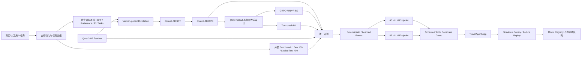

# TravelAgent：大厂级后训练、外部评测与在线验证升级 SPEC

> 文档版本：v1.0  
> 编写日期：2026-08-15  
> 当前状态：Proposed  
> 实施阶段：Phase 26～32  
> 冻结基线：阶段 25 `stage25-final-showcase-v1`  
> 目标岗位：大模型 Agent 算法、应用后训练、Agentic RL / Evals Research Engineer  

## 1. 文档目的

TravelAgent 已经完成生产型 Agent Loop、数据治理、QLoRA 蒸馏 SFT、DPO、trajectory-level GRPO-B0、4B/8B 路由、vLLM 推理消融以及 App 可观察性。本 SPEC 不重复建设这些能力，而是解决当前成果与大厂招聘标准之间仍然存在的四个证据缺口：

1. 当前 Qwen3 冻结集规模较小，且主要由项目内部构建，缺少独立、人工撰写或真实请求组成的外部评测；
2. Qwen3 主线已完成 SFT+DPO，但正式 GRPO 证据来自 Qwen2.5-3B，尚无 Qwen3 同协议 RLVR / GRPO 对照；
3. 4B/8B Router 已完成真实模型顺序回放，但尚未完成双端点同时在线、故障注入、持续负载和灰度回滚；
4. 当前训练主要在单张 RTX 4090 上完成，尚缺分布式训练、断点恢复和生产模型生命周期的可展示证据。

本轮成功定义不是继续堆叠功能，而是让第三方仅凭代码、数据卡、模型卡、冻结报告和演示，即可独立确认以下事实：

- 模型能力提升不是模板泄漏或内部测试集饱和造成的；
- SFT、DPO、GRPO/RLVR 各自解决的问题可以被同协议消融识别；
- Router 的质量、成本与失败边界经过真实在线服务验证；
- 训练、评测、服务和发布流程可以复现、恢复和回滚；
- 简历中的每个数字都有原始输入、脚本、配置、日志和哈希支撑。

## 2. 当前冻结基线

本 SPEC 以阶段 25 的结果作为只读基线。任何后续实验必须与基线配对比较，不得覆盖或重新选择既有 test。

### 2.1 Qwen3 最终候选

| 指标 | 冻结结果 | 解释边界 |
|---|---:|---|
| 严格单步工具决策 | 516 / 516 | Router 顺序模型回放，172 题 × 3 次 |
| 完整多轮任务 | 172 / 172 | 内部冻结工程 benchmark |
| 平均 Reward | 0.965842 | `hierarchical-b0.v1` 体系 |
| 8B 教师任务占比 | 2.33% | 确定性任务族路由 |
| 相比全量 8B 的生成 Token | -28.52% | 同一批 172 个多轮任务 |
| 相比全量 8B 的模型请求延迟 | -47.87% | 不含外部工具 API 时间 |
| DPO mean log-prob margin | +22.60% | 与 SFT 在完全相同的 172 个偏好对上比较 |
| CUDA Graph 平均延迟 | -7.52% | 预热后的常驻服务结果 |
| CUDA Graph P95 | -9.71% | 相对 eager 静态合并模型 |

### 2.2 GRPO 已有证据

Qwen2.5-3B 已完成生产状态机对齐的 trajectory-level GRPO-B0：

| 模型 | 32 题 × 4 rollout 成功率 | 平均 Reward |
|---|---:|---:|
| Base | 60.16% | 0.2301 |
| SFT | 80.47% | 0.5934 |
| SFT+GRPO | 82.81% | 0.6373 |

该结果证明项目具备真实环境 rollout、分层 Reward、非零方差任务选择和 checkpoint 晋升门能力，但它不等同于 Qwen3 主线上的正式 RL 对照，也不支持“已经解决逐轮信用分配”的表述。

### 2.3 冻结证据入口

- `ml/agentic/reports/stage24-final-evaluation-v1/report.json`
- `ml/agentic/reports/stage24-final-evaluation-v1/REPORT.md`
- `ml/agentic/reports/stage25-showcase-v1/showcase.json`
- `ml/agentic/reports/stage25-showcase-v1/SHOWCASE.md`
- `docs/worklogs/2026-08-15_阶段24统一后训练消融与最终评估.md`
- `docs/worklogs/2026-08-15_阶段25部署演示与项目表达收口.md`

## 3. 岗位目标与验收层级

### 3.1 L1：大模型应用算法 / Agent 算法岗

必须证明：

- 能把模型接入真实 Agent 状态机，而不是只做聊天微调；
- 能构建工具调用、澄清、恢复和约束权衡数据；
- 能执行 SFT、偏好优化、评测和推理部署；
- 能用 verifier、Shadow、A/B、回退和可观察性保护产品质量。

当前状态：主体能力已经具备。本 SPEC 主要补外部评测和线上双端点证据。

### 3.2 L2：应用后训练 / Agentic RL Research Engineer

除 L1 外，还必须证明：

- 能形成可证伪的研究假设，而不是只调训练参数；
- 能区分数据收益、SFT 收益、DPO 收益、RL 收益和推理约束收益；
- 能处理零方差、Reward Hacking、KL 漂移和策略退化；
- 能实现同协议 B0 / R1 或等价信用分配对照；
- 能设计独立 benchmark，并对统计置信度和失败类型负责。

当前状态：已具备工程基础，缺 Qwen3 RL 对照与更强外部 benchmark。

### 3.3 L3：训练与推理平台资深岗

典型要求还包括多机多卡、Ray/KubeRay、FSDP、NCCL、弹性恢复、模型注册、Canary、自动扩缩容和生产事故经验。本 SPEC 只要求补齐“可验证的分布式训练与发布闭环”，不宣称一次迭代即可达到资深平台岗要求。

## 4. 总体目标与非目标

### 4.1 必须完成的目标

1. 建立 500 条独立外部评测，至少 400 条在开发期间保持封存；
2. 在 Qwen3-4B DPO 基线上完成训练集非零方差审计，并依据审计决定是否执行正式 GRPO/RLVR；
3. 若存在足够学习信号，完成 DPO、DPO+GRPO-B0、DPO+GRPO-R1 同协议对照；
4. 构建 deterministic Router 与 learned Router 的配对消融，但确定性安全回退始终保留；
5. 使用两个独立推理端点完成真实并发、故障注入和 Canary 演练；
6. 完成至少一次双 GPU 训练、checkpoint 恢复和结果一致性 smoke；
7. 形成可公开的代码、README、模型卡、数据卡、技术报告和演示视频。

### 4.2 非目标

- 不从头预训练基础模型；
- 不为了“参数量更大”盲目升级到超出预算的模型；
- 不用内部 172 题继续调参后再报告同一 test；
- 不把 LLM Judge 当作硬约束和工具正确性的唯一裁判；
- 不训练或公开私有思维链；
- 不把双模型顺序回放称作在线并发部署；
- 不为满足简历关键词而进行没有独立收益假设的 GRPO；
- 不在未获得授权的情况下使用真实用户隐私数据。

## 5. 目标架构



### 5.1 不变的安全原则

- 模型选择动作，程序持有事实和硬约束裁决权；
- Router 只能选择策略模型，不能绕过 Guard、Validator 或预算；
- learned Router 置信度不足时回到 deterministic Router；
- 学生失败只升级一次教师；教师失败进入确定性 fallback；
- 所有训练和发布候选都必须可以回放、比较、拒绝和回滚。

## 6. Workstream A：独立外部评测集

### 6.1 数据规模与组成

建立 `travel-agent-external-benchmark.v1`，总计 500 个任务：

| 来源 | 数量 | 要求 |
|---|---:|---|
| 经授权、去标识化的真实或仿真用户需求 | 200 | 不由现有模板直接改写 |
| 人工撰写的多约束与冲突任务 | 150 | 覆盖预算、日期、must-visit、节奏和同行人冲突 |
| 工具故障与恢复任务 | 100 | 空结果、超时、限流、陈旧数据、参数错误 |
| 长上下文修改与行中重规划 | 50 | 至少包含一次已确认内容与新事件冲突 |

若无法合法获得真实请求，则由至少两名不了解现有模板实现的人独立撰写。至少 60% 的任务必须是人工原生表达，而不是由当前教师模型或数据脚本生成。

### 6.2 切分协议

- External Dev：100 条，仅用于评测脚本、标注规范和可视化调试；
- Sealed Test：400 条，在所有模型、Router 和阈值冻结前不得查看逐题结果；
- 以用户请求族、城市、日期模式、约束组合和故障模板做 group split；
- 任意 normalized prompt、tool payload、constraint fingerprint 或 task family group 不得跨 Dev/Test；
- 每次构建输出内容哈希、group overlap 报告和 immutable manifest；
- External Benchmark 永不进入 SFT、DPO、GRPO 或 Router 训练。

### 6.3 标注协议

每个任务至少包含：

- 允许的策略动作集合；
- 必须出现或禁止出现的参数；
- 可程序验证的硬约束；
- 可接受的澄清问题或取舍类别；
- 成功、部分成功、失败和安全终止定义；
- 对应工具快照或故障注入配置；
- 预期终止类型和最大步骤预算。

所有 Sealed Test 至少双人独立标注；冲突由第三人裁决。动作类别 Cohen's κ 目标不低于 0.75。低于目标时暂停模型评测，先修订标注规范。

### 6.4 外部评测指标

- Task Success Rate；
- Hard Constraint Pass Rate；
- Tool Selection / Argument Accuracy；
- Recovery Success Rate；
- False Finish Rate；
- Unnecessary Clarification Rate；
- Unsafe Action Rate；
- Steps、Tool Calls、Completion Tokens；
- 模型 TTFT、TPOT、平均/P95/P99 延迟；
- 按任务族、难度、上下文长度和故障类型分桶结果；
- 95% bootstrap confidence interval；
- 失败案例和最小复现输入。

### 6.5 晋升门

任何新模型相对当前 Router 必须同时满足：

- Hard Constraint Pass Rate 不下降；
- Unsafe Action Rate 不增加；
- 总成功率的 95% CI 下界不低于基线 -1 个百分点；
- 若宣称质量提升，成功率至少提升 2 个百分点，或目标失败族提升 5 个百分点；
- 若宣称效率提升，在成功率非劣条件下 Token、模型调用次数或延迟至少一项改善 10%；
- 不允许只报告总体平均值而隐藏某个任务族的明显退化。

## 7. Workstream B：Qwen3-4B RLVR / GRPO

### 7.1 研究问题

正式训练只回答以下可证伪问题：

> 在 Qwen3-4B SFT+DPO 已经具备稳定工具决策能力后，使用可验证多轮环境和非零方差任务进行 GRPO/RLVR，能否在不降低硬约束与基础能力的前提下，改善恢复、复杂取舍或执行效率？

如果训练前审计表明没有足够组内方差，则结论应是“当前任务分布不适合继续 RL”，而不是通过提高温度、污染 test 或扭曲 Reward 强行得到非零 loss。

### 7.2 训练语料

新建独立训练集 `qwen3-stage28-rl-tasks-v1`：

- 任务总量目标 2,000～5,000；
- clarification、search、recovery、tradeoff、long-context modification 分层；
- 只使用历史 train 数据、人工新写任务和训练环境扰动；
- 不读取阶段 21～25 frozen test 和 External Benchmark；
- 每个任务保存 snapshot version、initial-state fingerprint 和 tool fault policy；
- 相同任务的所有 group rollout 从等价初始状态开始。

### 7.3 训练前模型感知审计

对候选训练任务执行至少 4 次随机 rollout，正式训练优先使用 group size 8。记录：

- 成功/失败分布；
- Reward 均值与方差；
- 动作序列多样性；
- 局部轮级 Reward 方差；
- completion length、重复工具调用和 invalid output；
- failure family 与首个错误步骤。

任务路由规则：

- 全成功且行为一致：作为回放锚点，不进入 GRPO 更新；
- 全失败：返回 SFT/DPO repair 池或降低任务难度；
- 成功率处于 10%～90% 且 Reward 非零方差：进入 RL 候选；
- 状态指纹、环境版本或工具快照不一致：拒绝；
- 有效 RL 任务不足 300 或占审计任务少于 15%：停止正式 GRPO，转做 hard-data SFT/DPO。

### 7.4 实验臂

必须保持同一基础模型、数据范围和评测协议：

1. DPO Baseline：阶段 22 最佳 adapter；
2. DPO + GRPO-B0：整轨可验证 Reward；
3. DPO + GRPO-R1：局部动作 Reward + 门控 future credit / return-to-go；
4. 可选 DPO + PPO/Turn-PPO：仅当 B0/R1 出现稳定性问题时作为对照，不在首轮同时扩张。

### 7.5 Reward 规则

硬门禁优先：

```text
Schema / protected argument / unsafe action / hard constraint failure
    => 直接负奖励，禁止效率分抵消

否则：
    task_success
  + verified_progress
  + recovery_quality
  + user_alignment
  - duplicate_tool_calls
  - unnecessary_clarification
  - completion_tokens_proxy
  - excessive_agent_steps
```

墙钟时间不直接进入训练 Reward，只在离线和服务评测中使用。训练使用 Token、调用次数和步骤数等稳定代理。

### 7.6 训练监控

- group zero-variance ratio；
- effective group ratio；
- KL、entropy、gradient norm；
- reward mean/std 与各分量；
- completion length；
- duplicate actions；
- invalid tool/schema rate；
- train/eval family distribution；
- checkpoint 前后逐任务 paired delta。

以下情况立即停止并回滚：

- 连续两个评测点 Hard Constraint Pass Rate 下降超过 1 个百分点；
- entropy 断崖下降并伴随重复动作上升；
- Reward 上升但 Validator 成功率下降；
- KL 超出预设预算且减小学习率/增加 beta 后仍持续；
- 有效 group 比例连续下降至 10% 以下；
- External Dev 明显退化但训练 Reward 上升。

### 7.7 Qwen3 RL 晋升门

GRPO/RLVR checkpoint 只有满足以下条件才可进入 Router 候选：

- Internal frozen test 和 External Dev 的硬约束均不下降；
- External Sealed Test 在冻结后只运行一次正式对比；
- 相对 DPO，目标任务族成功率提升至少 5 个百分点，或总成功率提升至少 2 个百分点；
- 如果成功率无显著提升，则 Token、重复动作或策略步至少一项减少 10%，且成功率非劣；
- 至少保留一次被拒绝 checkpoint 及拒绝原因，证明晋升门真实生效；
- R1 未超过 B0 时如实报告，不以实现复杂度代替收益。

## 8. Workstream C：Learned Router

### 8.1 目标

在保留 deterministic Router 作为安全基线的前提下，验证 learned Router 能否识别“学生可能失败但教师可以成功”的状态，从而处理任务族规则无法覆盖的复杂度变化。

### 8.2 训练标签

在 Router Train 上对 4B 和 8B 做配对推理，标签依据 verifier 结果生成：

- 学生成功：优先 student；
- 学生失败、教师成功：teacher；
- 两者都失败：fallback / abstain，不作为简单 teacher 正例；
- 两者都成功：根据 Token、延迟和质量 margin 计算 utility，默认 student；
- 任意安全门禁差异：选择通过安全门禁的一方。

Utility 只用于两者都成功时的成本选择：

```text
utility = quality_gate
        - λ_token * normalized_tokens
        - λ_latency * normalized_model_latency
```

λ 只在 Router Validation 上选择，禁止使用 External Test 调参。

### 8.3 Router 输入

- 当前 Task DAG 节点与剩余任务；
- allowed actions；
- 约束数量与冲突类型；
- failure summary 与重试次数；
- prompt/context token 长度；
- 学生最近的 schema/工具错误；
- 不包含用户 PII、完整自然语言历史或隐藏推理。

### 8.4 模型与回退

首版使用可解释轻量模型：Logistic Regression、LightGBM 或小型 MLP。只有当轻量模型无法达到门禁时才评估语言模型 Router。

执行顺序：

1. hard safety rule；
2. learned Router；
3. 置信度低于阈值时 deterministic Router；
4. student 输出门禁失败时单次 teacher fallback；
5. teacher 失败时 deterministic fallback。

### 8.5 对照与门禁

对照臂：

- All Student；
- All Teacher；
- Deterministic Router；
- Learned Router；
- Learned Router + confidence abstention。

Learned Router 晋升条件：

- External Test 成功率不低于 Deterministic Router -1 个百分点；
- unsafe miss 为 0；
- teacher call share 相对 Deterministic Router 不增加，或增加部分带来显著质量收益；
- 教师必要调用召回率不低于 95%；
- Expected Calibration Error 目标不高于 0.05；
- 规则、特征、阈值和失败样本可解释；
- 未通过门禁时保留 deterministic Router，不强行上线。

## 9. Workstream D：双端点在线服务

### 9.1 部署形态

正式在线验证至少需要两个可同时访问的推理端点：

- Student Endpoint：Qwen3-4B 最佳静态模型，vLLM + CUDA Graph；
- Teacher Endpoint：Qwen3-8B，独立 GPU 或独立云实例；
- Router/API：无模型权重，负责选择、超时、重试、熔断和审计；
- Deterministic Fallback：在两个模型均不可用时返回安全降级。

单张 24GB GPU 的顺序启动只用于离线复现，不可通过本阶段在线门禁。

### 9.2 服务契约

每个请求必须记录：

- request/trajectory ID；
- requested target 与 executed target；
- route reason 与 confidence；
- student/teacher endpoint version；
- fallback count 与 error code；
- prompt/completion/cache tokens；
- queue time、TTFT、TPOT、request latency；
- schema/tool/constraint gate；
- 最终 task success 与 termination reason。

不得记录认证信息、原始敏感字段和私有思维链。

### 9.3 负载矩阵

每个候选至少执行：

| 测试 | 持续时间/规模 | 目标 |
|---|---:|---|
| Warm-up | 完成 CUDA Graph capture | 排除冷启动长尾 |
| 稳态 c1/c4/c8/c16 | 每档至少 1,000 请求 | 得到吞吐与 P50/P95/P99 |
| 30 分钟 soak | 真实任务族配比 | 检查显存、队列和错误率漂移 |
| 4B endpoint 故障 | 至少 100 请求 | 验证 teacher fallback 和熔断 |
| 8B endpoint 故障 | 至少 100 请求 | 验证安全降级而非循环重试 |
| 网络超时/限流 | 分层注入 | 验证 deadline 与 retry budget |
| Canary | 1%→5%→20%→50% | 验证自动暂停与回滚 |

### 9.4 在线晋升门

- Router 端到端成功率不低于 All Teacher -1 个百分点；
- Hard Constraint Pass Rate 与 Unsafe Action Rate 不劣于 All Teacher；
- 模型决策 P95 在并发 8 下目标不高于 600 ms；
- 相比 All Teacher，平均模型延迟降低至少 30%；
- 相比 All Teacher，生成 Token 或 GPU 成本至少降低 20%；
- 30 分钟 soak HTTP error rate <0.5%，无持续显存增长；
- 任一端点故障时无无限重试、无跨请求状态污染；
- Canary 触发门限后 5 分钟内完成自动或一键回滚。

若外部工具 API 主导端到端延迟，必须分别报告 model-only 与 full-request，不得用其中一项替代另一项。

## 10. Workstream E：分布式训练与恢复证据

### 10.1 最小目标

至少租用一次双 GPU 环境完成可复现 smoke，建议 2×24GB、2×48GB 或更高。必须包含：

- PyTorch DDP 或 FSDP 二选一正式实现；
- QLoRA/SFT 或 DPO 至少 100 optimizer steps；
- gradient accumulation 与 mixed precision；
- checkpoint 保存、进程重启和 resume；
- 单 GPU 与双 GPU 的 loss/metric 对齐检查；
- NCCL 环境、GPU 拓扑、显存峰值和吞吐记录。

### 10.2 可选增强

- Ray Train / KubeRay；
- 多节点 NCCL；
- veRL / Ray rollout workers；
- 弹性训练与 spot interruption recovery；
- 数据流式读取和 object store；
- FSDP state-dict consolidation。

这些增强只在算力可用且不影响外部评测主线时执行。

### 10.3 分布式门禁

- resume 后 optimizer step、scheduler、RNG 和数据游标可验证；
- 同 seed 下单/双 GPU 关键 eval 指标误差处于预设容差；
- 无 silent data duplication 或 skipped batches；
- rank0 artifact、配置和日志完整；
- 任一 worker 失败不会产出标记为成功的残缺 checkpoint；
- README 能在新环境执行最小复现。

## 11. 模型生命周期与可观察性

### 11.1 Artifact 规范

每次正式实验必须保存：

- resolved config；
- base model revision；
- adapter/model SHA-256；
- dataset manifest 与 split hash；
- git commit 和 dirty-worktree 状态；
- dependency lock；
- hardware/runtime 信息；
- train/eval metrics；
- 原始失败案例；
- promotion decision 与拒绝原因。

### 11.2 Registry 状态

```text
created
  → preflight_passed
  → trained
  → internal_eval_passed
  → external_eval_passed
  → shadow
  → canary
  → production

任意阶段 → rejected / rolled_back
```

Registry 不只保存“最好模型”，还必须保存被拒绝候选及其拒绝理由。

### 11.3 线上指标

- route share；
- fallback rate；
- teacher necessary recall；
- per-family success；
- invalid tool/schema rate；
- false finish；
- Token、TTFT、TPOT、P50/P95/P99；
- queue depth 与 GPU utilization；
- endpoint timeout/error；
- model version 与回滚事件。

## 12. 开源与项目交付

### 12.1 代码仓库

公开或面试交付前必须：

- 清理当前 dirty worktree，按 Agent Loop、训练、评测、路由、服务拆分可审阅提交；
- 删除临时 archive、缓存、模型权重和本地测试产物；
- 确认任何 SSH、API、JWT、数据库或对象存储凭据均未进入 Git 历史；
- 提供 `.env.example`，真实 secret 只从环境或 secret manager 注入；
- 增加 license、贡献说明和安全边界；
- CI 至少执行单元测试、格式、类型检查和小型报告 fixture。

### 12.2 README 必须回答

1. 为什么旅行 Agent 需要“模型策略 + 确定性求解”；
2. SFT、DPO、GRPO 分别训练什么；
3. 如何防止数据泄漏和 Reward Hacking；
4. 4B/8B Router 如何决策与回退；
5. 如何一条命令运行最小 demo；
6. 如何生成所有核心报告；
7. 哪些结果是内部 benchmark、哪些是 external sealed test；
8. 哪些能力尚未完成。

### 12.3 模型卡和数据卡

模型卡至少包含：

- base revision、训练方法与超参数；
- 训练数据来源与禁止用途；
- 评测协议和结果；
- 适用动作空间；
- 已知失败类型；
- 安全回退；
- 硬件与许可证。

数据卡至少包含：

- 来源、授权、去标识化；
- family/difficulty 分布；
- dedup 与 split 方法；
- 标注协议和一致性；
- 不允许进入训练的 benchmark 清单；
- 数据限制与偏差。

### 12.4 演示视频

5～8 分钟，固定脚本：

1. 30 秒说明问题与架构；
2. clarification → 4B；
3. search → 4B；
4. recovery → 4B；
5. tradeoff → 8B；
6. 注入学生失败 → 单次教师升级；
7. 展示 route trace、Token 和 latency；
8. 展示外部 benchmark 与被拒绝 checkpoint；
9. 说明单卡、数据和 GRPO 边界。

## 13. 统一实验矩阵

### 13.1 模型对照

| Arm | Internal Frozen | External Dev | External Test | 在线压测 |
|---|---:|---:|---:|---:|
| Qwen3-4B Base | 必须 | 必须 | 一次 | 可选 |
| Qwen3-4B SFT | 必须 | 必须 | 一次 | 可选 |
| Qwen3-4B SFT+DPO | 必须 | 必须 | 一次 | 必须 |
| Qwen3-4B DPO+GRPO-B0 | 若训练 | 必须 | 一次 | 若晋升 |
| Qwen3-4B DPO+GRPO-R1 | 若训练 | 必须 | 一次 | 若晋升 |
| Qwen3-8B Teacher | 必须 | 必须 | 一次 | 必须 |
| Deterministic Router | 必须 | 必须 | 一次 | 必须 |
| Learned Router | 若通过 validation | 必须 | 一次 | 若晋升 |

### 13.2 消融

- 无 verifier filtering；
- SFT only vs SFT+DPO；
- DPO vs DPO+GRPO-B0；
- B0 vs R1；
- 无长度/步骤效率项；
- unconstrained vs state-constrained actions；
- dynamic LoRA vs static merge；
- eager vs CUDA Graph；
- deterministic vs learned routing；
- no fallback vs teacher fallback；
- single endpoint vs dual endpoint。

每个消融只改变一个主要变量；无法做到时必须列出混杂因素。

## 14. 阶段计划

### Phase 26：仓库与证据冻结

产物：

- 阶段 25 tag / release candidate；
- 清洁 Git 状态与 secret scan；
- 基线一键报告；
- 当前模型、数据、报告哈希清单。

完成门：新环境能够验证 archive 哈希并重新生成阶段 24/25 摘要。

### Phase 27：External Benchmark

产物：

- 500 条任务；
- 标注指南；
- 双标与 κ 报告；
- Dev/Test group split 和泄漏审计；
- Base/SFT/DPO/8B/Router 外部基线。

完成门：400 条 Sealed Test 在候选冻结前无逐题访问记录。

### Phase 28：Qwen3 RL Go/No-Go

产物：

- 2,000～5,000 训练任务；
- 随机 rollout 审计；
- effective group 报告；
- Go/No-Go 决策。

完成门：有效任务不足则正式 No-Go，并转 hard-data SFT/DPO；不得把停止视为失败。

### Phase 29：Qwen3 GRPO/RLVR 与信用对照

仅在 Phase 28 Go 时执行。

产物：

- B0 checkpoint；
- R1 checkpoint；
- 稳定性曲线；
- paired promotion gate；
- 至少一个 rejected checkpoint 案例。

完成门：通过第 7.7 节，否则继续使用 DPO。

### Phase 30：Learned Router

产物：

- 配对 Router 数据；
- 轻量 Router；
- calibration 与 error analysis；
- deterministic / learned / abstain 对照。

完成门：通过第 8.5 节，否则保留 deterministic Router。

### Phase 31：双端点与分布式工程

产物：

- 同时在线 4B/8B 服务；
- c1/c4/c8/c16 与 soak 报告；
- 故障注入和 Canary 回滚记录；
- 双 GPU DDP/FSDP + resume smoke。

完成门：通过第 9.4 与第 10.3 节。

### Phase 32：发布与项目表达

产物：

- README、技术报告、模型卡、数据卡；
- 一键 demo；
- 5～8 分钟演示视频；
- 中英文简历 bullet；
- 最终 release archive 与 checksum。

完成门：第三方在不读取私人工作日志的情况下，可以复现最小 demo、理解指标来源并识别边界。

## 15. 资源预算

### 15.1 最低配置

- 单 GPU 4090：数据构建、单模型训练、离线评测；
- 双 GPU 云实例：分布式 smoke 和双端点在线验证；
- CPU/内存：至少 16 vCPU / 64GB 用于并发服务和数据处理；
- 磁盘：预留 300GB，模型权重、optimizer state 和报告分目录管理。

### 15.2 成本控制

- Phase 27 外部 benchmark 优先于扩大训练；
- Phase 28 未通过 Go 门时不消耗正式 GRPO 算力；
- 双端点按压测窗口租用，不长期空转；
- 先用 100-step 分布式 smoke 验证恢复，再扩大；
- 所有失败实验只保留必要 checkpoint、日志和复现配置。

## 16. 风险与停止条件

| 风险 | 识别信号 | 应对 |
|---|---|---|
| External Benchmark 仍被模板污染 | Base/所有模型接近饱和，失败类型单一 | 增加人工原生任务和跨实现撰写者 |
| 标注不稳定 | κ <0.75 | 暂停评测，修订 rubric 并重标 |
| Qwen3 RL 无有效梯度 | zero-variance 高、有效任务 <15% | No-Go，回到 hard-data SFT/DPO |
| Reward Hacking | Reward 升、Validator 降 | 回滚并强化硬门禁 |
| Learned Router 过度调用教师 | teacher share 上升但质量无改善 | 提高成本项或拒绝 learned Router |
| Router 漏掉高风险任务 | teacher necessary recall <95% | hard rule 前置，降低 abstain threshold |
| 双端点尾延迟恶化 | queue/P99 持续增长 | 限流、并发隔离、熔断和容量扩展 |
| 分布式恢复不一致 | resume loss 跳变、数据重复 | 保存 sampler/RNG/data cursor，拒绝 checkpoint |
| 开源泄密 | secret scan 命中 | 停止发布、轮换凭据、清理历史 |
| 范围失控 | 同时开发多种 RL/Router/Serving 框架 | 按 Phase 门逐项推进 |

## 17. 可陈述与禁止陈述

### 17.1 完成 L1 后可陈述

> 在生产型旅行 Agent 上完成 verifier-guided 数据治理、QLoRA 蒸馏 SFT、DPO、真实多轮 GRPO-B0、4B/8B 路由与 vLLM 推理优化，并使用独立人工 benchmark、双端点负载和故障注入验证质量、成本与回退。

### 17.2 完成 Phase 29 后可追加

> 在 Qwen3-4B DPO 基线上构建非零方差多轮任务，完成 trajectory-level B0 与 turn-credit R1 同协议对照；只有通过 External Sealed Test 和硬约束门禁的 checkpoint 才进入服务候选。

### 17.3 完成 Phase 31 后可追加

> 完成双 GPU 分布式训练与断点恢复 smoke，并将 4B/8B 部署为独立 vLLM 端点，执行并发、soak、故障注入和 Canary 回滚。

### 17.4 禁止陈述

- “在公开 benchmark 达到 SOTA”，除非确有公开、可比结果；
- “解决了 Long-Horizon credit assignment”，除非 R1 对照和外部证据支持；
- “生产部署双模型”，如果只有顺序回放；
- “大规模分布式训练”，如果只运行双卡 smoke；
- “DPO 将准确率提升到 100%”，因为既有 paired preference accuracy 已饱和；
- “模型成功率 100%”，不说明数据集规模、来源和置信区间；
- “真实用户数据”，如果任务来自人工仿真或模板生成。

## 18. Definition of Done

本 SPEC 只有同时满足以下条件才完成：

1. 500 条 External Benchmark 完成授权、去标识化、双标、group split 和哈希冻结；
2. 400 条 Sealed Test 在模型、Router 和阈值冻结后只执行一次正式评测；
3. Qwen3 RL 完成 Go/No-Go；Go 则完成 B0/R1，对照失败也要保留；
4. Deterministic 与 Learned Router 完成同协议比较，未晋升候选不进入生产；
5. 4B/8B 两个端点同时在线并完成负载、soak 和故障注入；
6. 完成一次双 GPU 训练、checkpoint 重启与 resume 验证；
7. 所有正式指标具有原始数据、配置、代码版本和 SHA-256；
8. 后端测试、前端类型检查和最小 E2E 全绿；
9. 仓库完成 secret scan，真实凭据不在工作区和 Git 历史；
10. README、模型卡、数据卡、技术报告、演示视频和最终 archive 完成；
11. 项目陈述明确区分 internal、external、offline replay 和 online serving；
12. 第三方可以在新环境运行最小 demo 并重新生成核心摘要。

## 19. 需求追踪矩阵

| ID | 需求 | Phase | 验收证据 |
|---|---|---|---|
| BG-001 | 建立 500 条独立 benchmark | 27 | manifest、标注和哈希 |
| BG-002 | 封存 400 条 test | 27 | access log、sealed manifest |
| BG-003 | Qwen3 RL 非零方差审计 | 28 | group audit report |
| BG-004 | Qwen3 B0/R1 对照 | 29 | checkpoint、曲线、paired eval |
| BG-005 | Learned Router | 30 | calibration、route confusion matrix |
| BG-006 | 双端点同时在线 | 31 | deployment config、健康检查 |
| BG-007 | 负载与故障注入 | 31 | c1/c4/c8/c16、soak、fault report |
| BG-008 | 双 GPU 训练恢复 | 31 | DDP/FSDP log、resume report |
| BG-009 | 模型生命周期 | 26～32 | registry 与 promotion record |
| BG-010 | 开源交付 | 32 | README、cards、video、release |

## 20. 参考依据

- QLoRA: <https://arxiv.org/abs/2305.14314>
- Direct Preference Optimization: <https://arxiv.org/abs/2305.18290>
- DeepSeekMath / GRPO: <https://arxiv.org/abs/2402.03300>
- RouteLLM: <https://arxiv.org/abs/2406.18665>
- vLLM Engine Arguments: <https://docs.vllm.ai/en/v0.10.0/configuration/engine_args.html>
- 项目既有研究：`docs/research/Agentic_RL_文献调研与SPEC修订建议_2026.md`
- 项目既有研究：`docs/research/Long_Horizon_Agentic_RL_最新论文精读与技术选型_2026-08.md`

以上论文和岗位能力要求只用于方法与验收设计，论文中的收益不得外推到 TravelAgent。所有最终数字必须来自本项目自己的 Internal Frozen、External Sealed Test 和真实在线服务报告。
